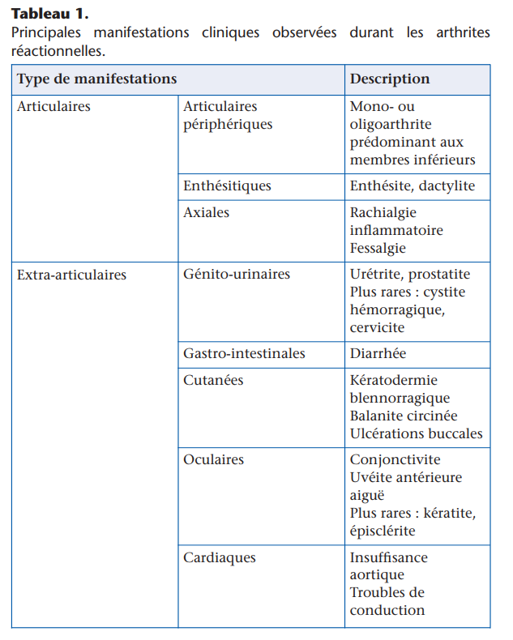

# Arthrites réactionnelles et autres rhumatismes inflammatoires post infectieux

**Arthrites réactionnelles = liées aux SPA :** 

- Urinaire = principalement chlamydia  = syndrome oculo-urétro-synovial = fessinger leroy (mais toujours rechercher gonocoque car peut faire de vraies arthrites septiques)
- Digestives :
    - Yersinia
    - E. Coli
    - Salmonelle
    - Shigelle
- Pulmonaire = chlamydia pneumoniae

Traitement : 

- Aigu = AINS (corticothérapie si inefficace)
- TTT de fond par anti-TNF++  ou sulfasalazine (une étude positive et une négative)

 

**Autres rhumatismes inflammatoires post infectieux :** 

- Rhumatisme post streptococcique (streptococcus pyogenes = du groupe A)
- Rhumatisme post méningococcique
- érythème noueux post-Yersinia, qui peut s’accompagner d’arthrites
- Rhumatisme post infection à bactérie intra-cellulaire :
    - Whipple ?
    - Mycoplasme

**Véritables arthrites septiques à bien différencier du reste :** 

- Bactériennes :
    - Gonocoque
    - Whipple ?

[Arthrites virales](Arthrites-réactionnelles/Arthrites%20virales%201f045f5988be80289b7ee7c50cd5d05d.md)

**Arthrites liées à des agents infectieux mais inclassables** 

[Borréliose de Lyme ](Arthrites%20r%C3%A9actionnelles%20et%20autres%20rhumatismes%20inf/Borr%C3%A9liose%20de%20Lyme%201d045f5988be806d8e81f06de5cf0dec.md)