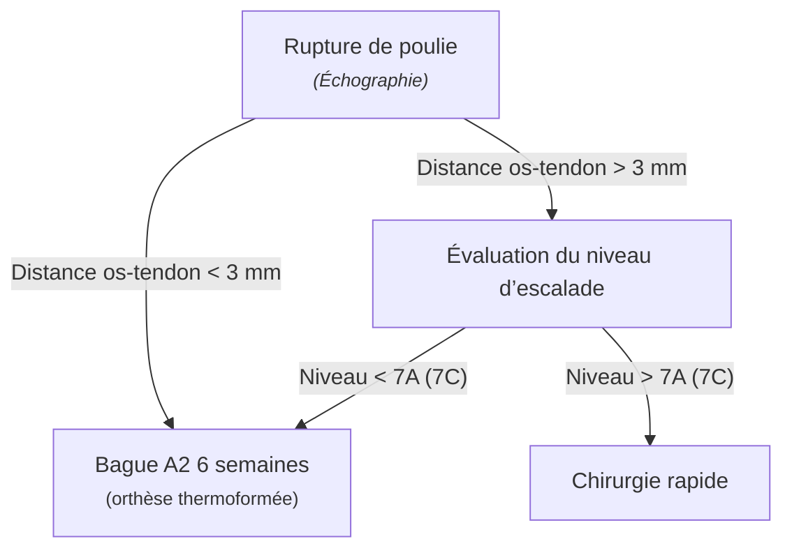

# Atteintes des poulies

### Poulies sièges de ruptures = A2 et A4

```mermaid
flowchart TB

A["Rupture de poulie<br><small><i>(Échographie)</i></small>"] 

A -->|"Distance os-tendon < 3 mm"| B["Bague A2 6 semaines<br><small>(orthèse thermoformée)</small>"]
A -->|"Distance os-tendon > 3 mm"| C["Évaluation du niveau d’escalade"]

C -->|"Niveau < 7A (7C)"| B
C -->|"Niveau > 7A (7C)"| D["Chirurgie rapide"]

```

### Poulie du doigt ressaut = A1