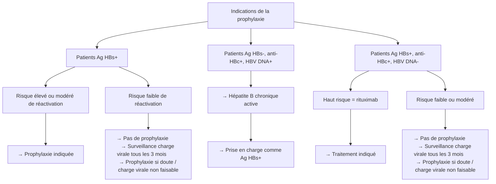

# Conduite à tenir en fonction de la sérologie hépatite B pré-biothérapie

### Indications de la prophylaxie :

- Patient avec des Ag HBs :
    - tous ceux qui sont à risque élevé ou modéré de réactivation
    - Pour les risques faible de réactivation : pas d’indication de prophylaxie, charge virale tous les 3 mois (prophylaxie si doutes si charge virale réalisable)
- Patients sans Ag HBs mais avec anticorps anti HBc et charge virale positive = hépatite B chronique active = à prendre en charge comme si il étaient Ag HBs +
- Patients avec des Ag HBs et anticorps anti HBc mais charge virale négative :
    - traiter que si haut risque = rituximab
    - Pour les riques faibles à modéré : pas d’indication de prophylaxie, charge virale tous les 3 mois (prophylaxie si doutes si charge virale réalisable)

### Rappels sur les sérologies VHB :

**HBsAg = marqueur d’une infection  :** 

- aigue (associées à IgM HBcAc)
- chronique si persiste 6 mois après infection aigue sans HBsAc

**HBsAc = marqueur d’une vaccination ou réponse immune contre le VHB = guérison** 

**HBcAc = marqueur d’une réponse immune contre le VHB (pas vaccination) :** 

- IgM à la phase aigue
- IgG en chronique

Marqueurs HBe et charge virale ⇒ sont utiles en cas d’infection chronique

### Sérologies à faire pré biothérapie :

- Ag HBs
- Ac anti HBc
- Charge virale **si Ac anti HBc est positif**

### Risque de récurrence en fonction de la molécule et du statut sérologique :

**Profil 1 = Infection active :**

- **HBsAg+** (infection aigue active)
- HBsAg- / anti-HBc+ **mais ADN VHB détectable** (infection occulte avec réplication virale = hépatite B chronique active)

**Haut risque de réactivation (>10%) :**

- Rituximab +++++ (et autres thérapies qui diminuent les lymmphocytes B)
- Anti TNF ++
- Corticoïdes ++ (> 20mg par jour plus d’un mois)
- JAK-i
- IL6-R inhibiteurs
- Anti IL-17
- TKI

**Risque moyen de réactivation :** 

- Anti IL12/23
- Abatacept (T cell activation blocking therapies)

**Risque faible de réactivation (<1%) :** 

- MTX
- Corticoïdes < 10mg par jour
- Inhibiteurs de checkpoint (immunothérapies)

**Profil 2 = Infection guérie ou ancien contact**, sans réplication virale actuelle

- **HBsAg- / anti-HBc+ / ADN VHB-**

**Haut risque de réactivation (> 10%) =** Rituximab +++++

**Risque moyen de réactivation :** 

- Anti TNF ++
- Corticoïdes ++ (> 40mg par jour)
- JAK-i
- Anti IL-17
- Anti IL12-23
- TKI

**Risque faible de réactivation (< 1%) :** 

- MTX
- Corticoïdes < 40mg par jour

**Pas d’infos pour les IL6R receptors inhibitors**