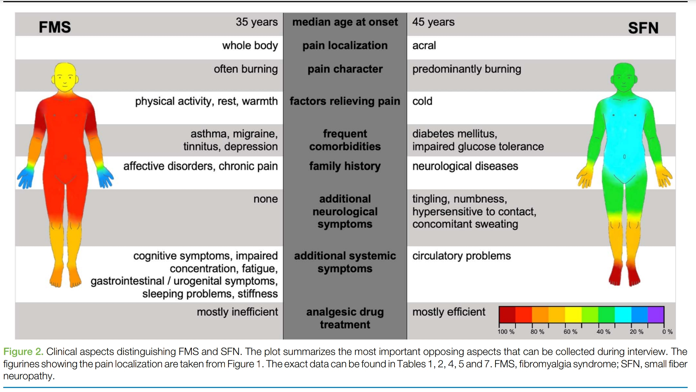

# Fibromyalgie et troubles somatiques fonctionnels

Diagnostics différentiels :

- Neuropathie des petites fibres : jusqu'à 1/3 des patients fibromyalgiques selon une étude

Neuropathie des petites fibres :

- Commence par une atteinte distale au niveau des pieds
- Puis peu se généraliser et faire un tableau de fibromyalgie ensuite
- Donc anamnèse ++++ :
 