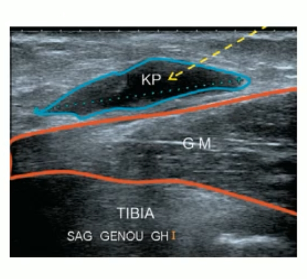
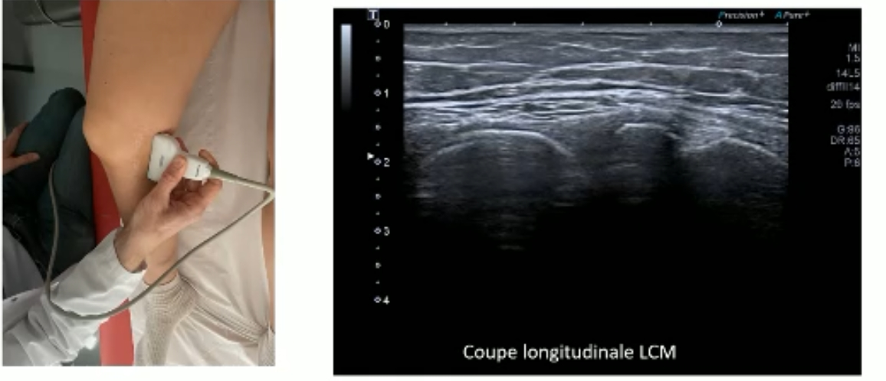
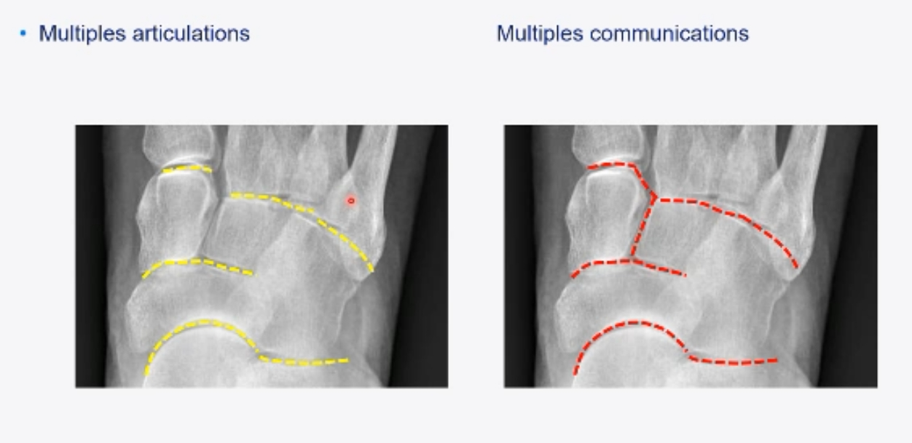

## Genou 
### Kyste poplité
Voie d'abord longitudinale (du bas vers le haut) est plus efficace pour bien vider le kyste !! 
Utiliser une aiguille verte voire rose car kystes souvent gelatineux. 
 
### Tendinobursite du tendon réfléchi du SM
Comment la trouver : 
- On part de la coupe longitudinale du LCM
- Translation vers l'arrière de la sonde + becquer vers l'avant => apparition d'une olive avec le tendon dedans.

- Puis on peut se le mettre en longitudinal si on veut. 
### Patte d'oie 
### Mur méniscal médial
## Cheville et pied 
### Sous talienne postérieure 
**=> 3 voies d'abord selon l'anatomie du patient**

**Antéro-lateral**
Hors plan ou dans le plan selon ostéophytes et présence épanchement ou pas. 
 
**Postérieur**
Hors plan
 
**Médial**
Hors plan. 
Plus difficile car passage à travers un ligament.
 
### Sous talienne antérieure 
Injecter dans la calcanéo-naviculaire car communique systématiquement avec la sous talienne antérieure. 
 
### Tarse 
**Communication entre les articulations du tarse ++++ :**
- Chopart communique dans 40% des cas
- Lisfranc dans 30% des cas 
- Mediotarse (naviculo-cunéenne) communique systématiquement avec 2 et 3eme cunéo-metatarsienne
 

=> On peut passer par des articulations+ facilement accessibles vu que ça communique.

Bien repérer avant infiltrations car bcp d'artères et de veines + trouver l'articulation la + accessible 

Toujours passer hors plan pour éviter les osteophytes. 
