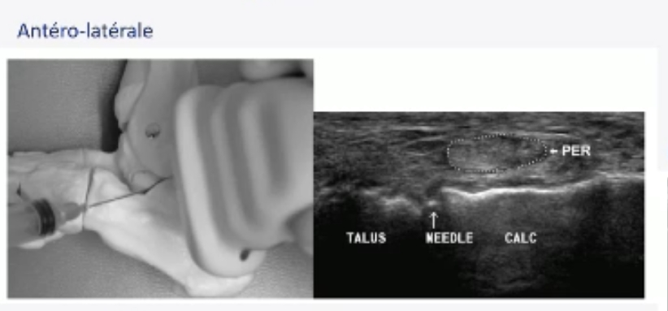
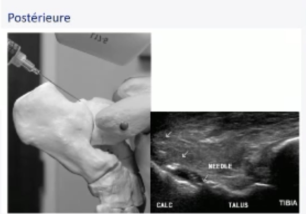
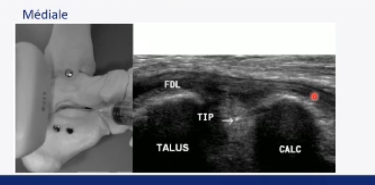
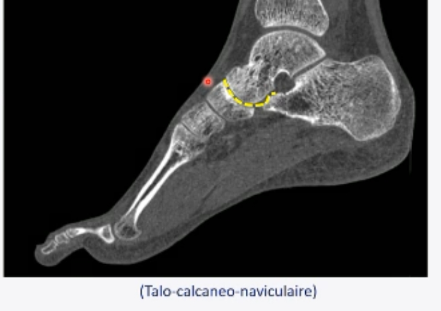

### Sous talienne postérieure 
**=> 3 voies d'abord selon l'anatomie du patient**

**Antéro-lateral**
Hors plan ou dans le plan selon ostéophytes et présence épanchement ou pas. 
 
**Postérieur**
Hors plan
 
**Médial**
Hors plan. 
Plus difficile car passage à travers un ligament.
 
### Sous talienne antérieure 
Injecter dans la calcanéo-naviculaire car communique systématiquement avec la sous talienne antérieure. 
 
### Tarse 
**Communication entre les articulations du tarse ++++ :**
- Chopart communique dans 40% des cas
- Lisfranc dans 30% des cas 
- Mediotarse (naviculo-cunéenne) communique systématiquement avec 2 et 3eme cunéo-metatarsienne

=> On peut passer par des articulations+ facilement accessibles vu que ça communique.

