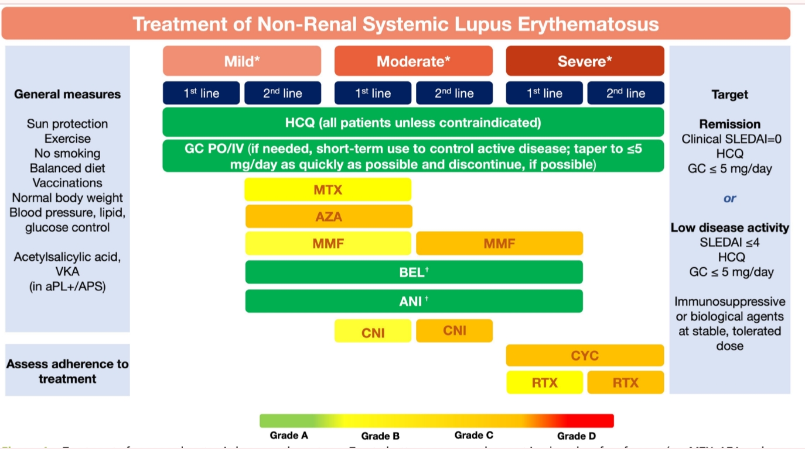
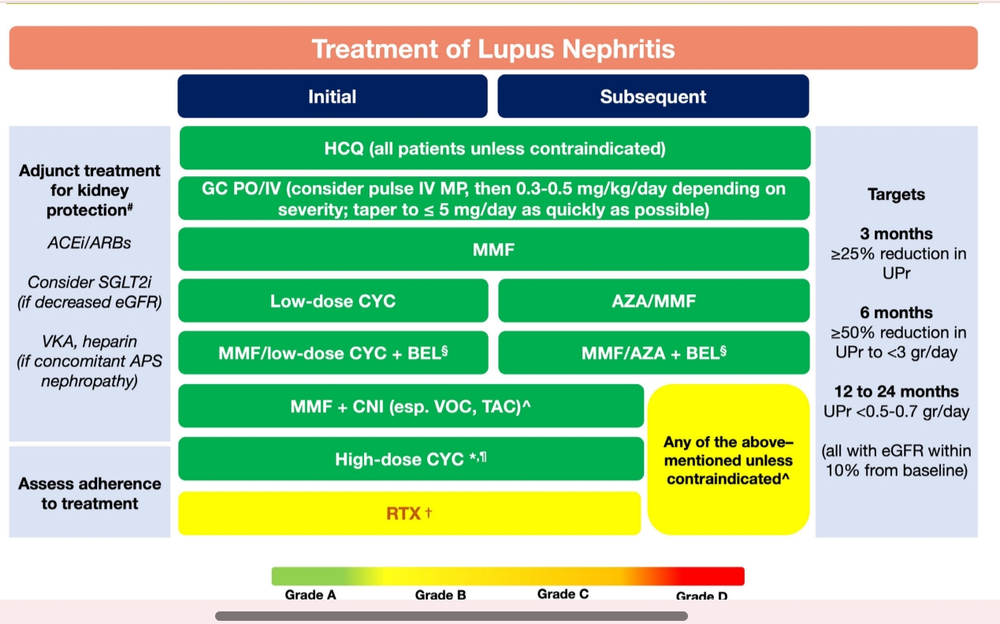

# Traitement
**Traitement de crise :**
Prednisone
AINS (PAS ibuprofen car risque de méningite aseptique)

**Traitement de fond**
Hydroxychloroquine pour tout le monde : 
* 5-6,5mg/kg
* En général ça fait 300mg => 1 cp jours impairs et 2 cps jours pairs
* Effets secondaires :
  * Digestifs transitoires : ttt symptomatique
  * Allergie cutanée rare => cs allergo
  * Retinopathie
  * "Jambes de plaquenil" = purpura
  * Cardiopathie => ECG Si lipothymies

MTX
MFM
Inhibiteurs des calcineurines (ciclosporine et tacrolimus)
Belimumab
Anifrolumab

**Mesures associées**
* Stop tabac (moins de poussées et meilleure efficacité du tttt)
* Photo protection (comme en population générale)
* Exercice physique
* Prévention infectieuse (pneumocoque +/- zona selon ttts)
* Aspirine en prévention primaire si triple positif des ac SAPL
 
 

# Objectif
SLEDAI < 5
CTC < 7.5mg/j
PGA < 1 
= LLDAS 
# Suivi
1 examen ophtalmologique de base puis un tous les 5 ans après 5 ans de ttt
Recherche de protéinurie
Observance => dosage HCQ > 200ng/ml sinon inobservance (dosage non remboursé en ville => forfait hôpital)

# Grossesse

Pas contre indiqué
Mais maladie en rémission depuis 6 mois (1 an si maladie rénale)
Stop MTX 

