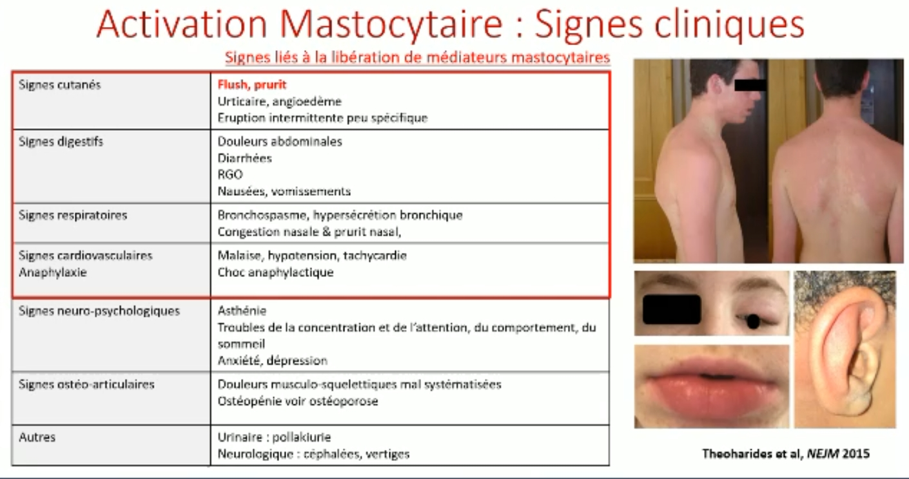
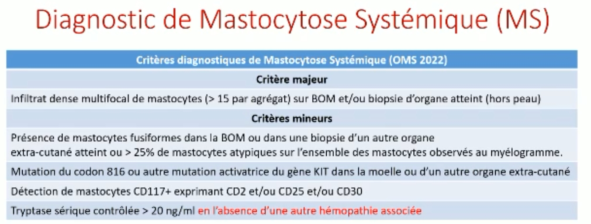

Maladies rares 1/3500 et hétérogènes 
Infiltration tissulaire de mastocytes monoclonaux 
Signes cliniques : 
- urticaire pigmentaire plus ou moins étendu (souvent en racine membre donc déshabiller patient)
- Signes digestifs
- anaphylaxie

Plus il y a de signes d'activation mastocytaire et plus la maladie est indolente ! 

 

### Mastocytose et rhumato 
Douleurs musculosquelettiques multiples mal systematisées. 

Atteinte osseuse radio : 
- aspect poivre et sel de l'os
- association de lesions lytiques et condensantes 
- ostéosclérose diffuse ou focale
- lesions lytiques
- infiltration médullaire en hypo T1 et aspect hétérogène en T2

**=> Cause d'ostéoporose chez le jeune**
Multiples fractures ***vertébrales*** et  ***biconcaves*** (pas cunéiformes).
 
