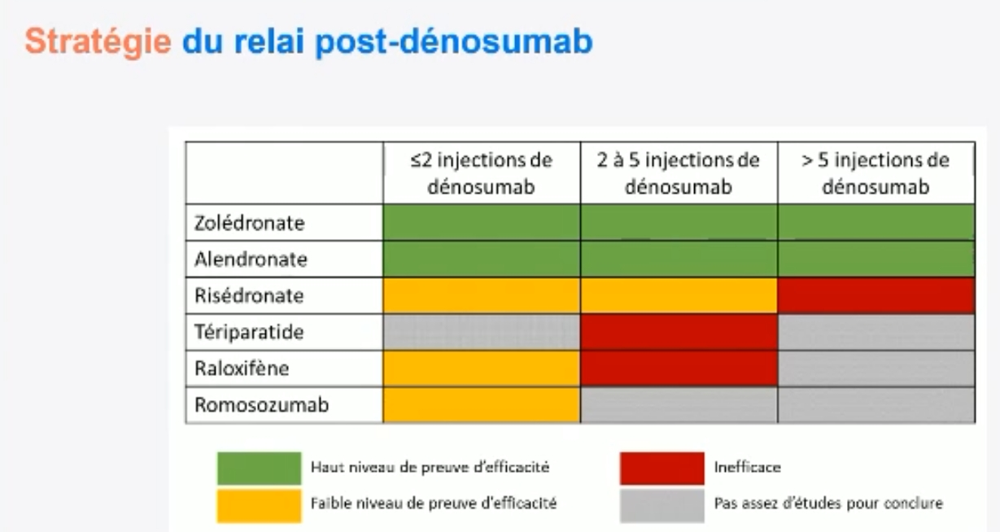

# Ostéoporose post menauposique 
## Evaluation para-clinique 
**Biologie** 
CTX : 
- Doser 6 mois après début de traitement (et à distance fracture)
- principalement adapté :
  - pour contrôle sous ttt per os pour vérifier l’observance
  - Après arrêt d'un anti resorbeur 
- valeur cible = norme femme non ménopausée = 0,3 ng/mL

P1NP :
- Pour le teriparatide (car marqueur de la formation osseuse)

## Traitements spécifiques :
**Biphosphonates**

**Teriparatide :**
Indication : 2 fractures vertébrales 

Contres indications :
- Radiothérapie
- Atcd de tumeur ou métastase osseuse : car médoc pro angiogenique mais enfaite ce n'est pas une contre indication formelle (principe de précaution plutôt)

Prescription : 
- 1 injection SC pendant 18mois (voire 2 ans hors AMM).
- Puis faire une perf d'aclasta de clôture à la fin du traitement.

**Denosumab :**
Indication : Ostéoporose fracturaire en 2 ème intention après biphosphonates 
Effets indésirables :
- Rebond fracturaire à l'arrêt
- Osteonecrose
- Fractures atypiques si utilisation prolongée 

**Raloxifene :**
Femme jeune < 70a non fracturaire sans contre indication veineuse cardiovasc ou cancer

**THM**

## Supplémentation vitamino calcique  :
Vitamine D quotidiennne en gouttes c'est le mieux en théorie (mais observance ?)
Les prises quotidiennes calcium-D3 : On peut les reconduire si le patient les tolère bien au niveau dig et qu’il les prend bien entre les repas
Sinon ampoules (moins bien en théorie sur la pharmaco mais enfaite peut être que ils les prendront mieux)

## Fracture sous traitement :

- Mauvaise efficacité si fracture > 1 an (18 mois - 2 ans)
- Il faut refaire le bilan d'Oz

## Fractures atypiques :
Sous TTT par biphosphonates ou denosumab depuis au moins 3 ans (incidence max a 7 ans)
**Physiopath** 
os ne se renouvelle plus sous traitement anti resorbeur prescrit trop longtemps 
**Epidemio**
Incidence = 50 / 100 000
Risque revient a zéro après 15 mois de fenêtre thérapeutique
**Clinique**
Prodromes pour les fractures atypiques fémorales (les + fréquentes) :
    - douleurs aine ou hanche ⇒ doivent faire réaliser rx de dépistage chez patient sous tt anti oz depuis au moins 3 ans
**Traitement :**
Décharge et chirurgie
Arrêter les anti résorbeurs ⇒ teriparatide
## Relais après denosumab
Aclasta à la date anniversaire du dernier Denosumab (6 mois après)
Au moins 1 perfs puis en faire d'autres selon les CTXs tous les ans (à Lyon Chapurlat fait des CTX tous les 3 mois pendant 2 ans)
 
# Autres Ostéoporose 

## Ostéoporose du sujet jeune (< 50 ans) :
Dmo < 2,5 avec ou sans fracture < 50 ans
60% = Oz secondaire : 
- mastocytose
- maladie coeliaque
- hyperparathyroïdie
- aménorrhée 
40% = idiopathique
En cas de cause idiopathique après avoir éliminé les causes secondaires (hyperpara du sujet jeune, maladie cœliaque, mastocytose, aménorrhée,…) il faut genotyper le patient ⇒ Panel génétique variants associés à fragilité osseuse avec un labo de génétique + consentement

## Ostéoporose et IRC sévère : 
   
**Que si DFG<30**

#### Troubles métaboliques à rechercher selon la bio :

**Os adynamique = Remodelage bas :** 
- PTH < 2-3N
- PALos < médiane
- P1NP bas
- Ca normal ou haut (si dialysé). 

**Hyperparathyroïdie :** 
- PTH > 6N (> 9N si dialysé)
- PALos > médiane (mais on retient pour > N en pratique)

**Zone grise :** 
- PTH 2-9N

=> Faire une _**biopsie osseuse**_

**Autres  + rares : ** 
- Ostéomalacie : P bas ; 25/1,25-OH basse ; PALos normale haute ; PTH un peu basse (donc autour de 2-3N). Rare en France, plutôt en lien avec les bains de dialyse inadaptés
- Mixte : Ostéomalacie + Hyperparathyroïdie : PALos N ; PTH un peu haute ; ou PALos et PTH non concordante, en pratique on ne peut pas conclure car n’écarte pas un os adynamique

#### Traitements 
**1) Qui traiter ?**

| Pathologie | Situation | Conduite à tenir |
| --- | --- | --- |
| **Os adynamique** | Général | Éviter les bisphosphonates (études souris : diminution des fractures meilleure que l'absence de traitement, sinon discuter bisphosphonates adaptés) |
|     | Pas de fracture | Pas de traitement ! Même si T-score ≤ -3 |
|     | Fracture | Tériparatide (mais pas de preuve). Pas de verrouillage car l'os se verrouille seul |
| **Hyperparathyroïdie secondaire** | Non contrôlée (> 6–9 N selon les cas) | Prise en charge néphro avant tout traitement |
|     | Fracture ou T-score < -2,5 | Bisphosphonates |
| **Hyperparathyroïdie tertiaire du greffé** |    | Prise en charge comme une hyperparathyroïdie primaire → plutôt chirurgicale |
| **Projet de greffe dans l'année** | Quel que soit le type d'os | Ne rien faire, attendre la greffe ! |

**2) Quels traitements utliser ?**

**_Dialysé :_**
- Tériparatide
- Dénosumab
- Pamidronate 30mg/3mois

_**Non dialysé :**_

Tériparatide (os adynamique)

Bisphosphonates : Risque os adynamique mais résolutif à l’arrêt du traitement, sinon aurait été adynamique même sans traitement

Alendronate 5mg (ACTONEL 5mg) : OK peu importe le DFG
Dénosumab à vie possible même si DFG<30. Risque hypocalcémie
Risédronate demi-dose (1/2sem ou 1/mois) : OK si DFG>20
Risédronate : OK si DFG>25
Alendronate 30mg : OK si DFG>35
Zolédronate : OK si DFG>30 avec perfusion lente (1h) ; Une étude avec DFG<30, souvent sans problème mais avec risque rare de complications rénales importantes (hémodialyse)

Alendronate et Risédronate possibles si DFG 15-30 uniquement dû à l’âge sans pathologie rénale ? _Miller PD, Roux C, Boonen S, et al. Safety and efficacy of risedronate in patients with age-related reduced renal function as estimated by the Cockcroft and Gault method : a pooled analysis of nine clinical trials. J Bone Miner Res 2005;20:2105-15._

## Ostéoporose masculine 