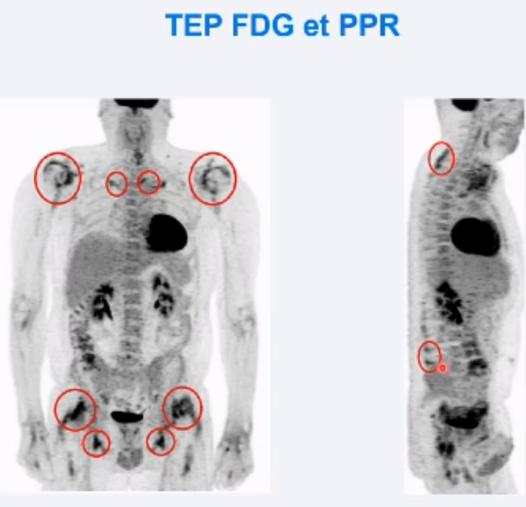

# Diagnostic 
1/3 des patients qui ont un diagnostic initial de PPR voient ce diagnostic révoqué après 1 an.
⇒ Donc importance d’éliminer des diagnostics différentiels ! 
### Radios + bio
Systématiques 
### Echo 
Si doute diagnostic 
### TEP 
A demander pour les cas avec **drapeaux rouges** de néoplasie ou ACG.
Demander un TEP **corps entier**
**Critères de qualité :**
- a jeun 
- glycémie < 1.26g/L (2 chez le diabétique)
- Faire le TEP idéalement dans les 3 jours du début de la corticothérapie
- Ou attendre 7 jours après leur arrêt 
**Fixations :**
- sensibles : peri ischiatiques
- spécifiques : inter épineuses lombaires et cervicales (pas dorsales)
- autres : épaules, sternoclaviculaires, hanches, grand trochanter,...
 

### PPR cortico résistante ou dépendante
TEP-TDM systématique a la recherche cause para néo (lymphome+++)
# Objectif 
DAS-PPR = PMR-AS Score :

- < 10 = rémission
- > 20 = forte activité

# Traitement 
Traitement d’épargne = tocilizumab dès le diagnostic si nécessaire de corticothérapie courte de 3 mois voir même pour éviter totalement les cortico