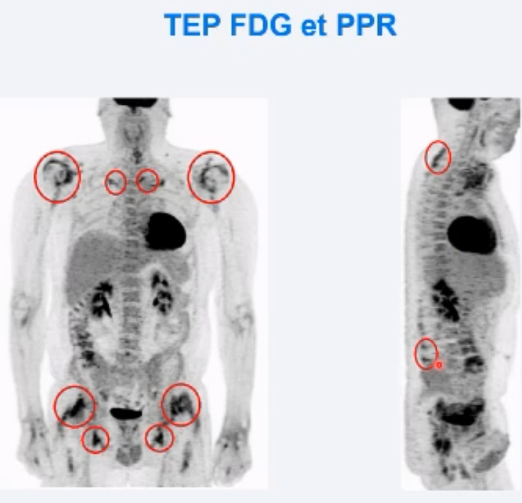

# Epidemio
10% des PPRs ont une ACG infraclinisue associée en TEP
8% ont un cancer en TEP (mais on ne sait pas si c'est + que population générale)
# Diagnostic 
1/3 des patients qui ont un diagnostic initial de PPR voient ce diagnostic révoqué après 1 an.

⇒ Donc importance d’éliminer : 
* des diagnostics différentiels : CCA, PR, paranéoplasique.
* Une ACG
### Radios + bio
Systématiques 
### Echo 
Si doute diagnostic 
### TEP 
A demander pour les cas avec **drapeaux rouges** de néoplasie ou ACG.
Demander un TEP **corps entier**
**Critères de qualité :**
- a jeun 
- glycémie < 1.26g/L (2 chez le diabétique)
- Faire le TEP idéalement dans les 3 jours du début de la corticothérapie
- Ou attendre 7 jours après leur arrêt 
**Fixations :**
- sensibles : peri ischiatiques
- spécifiques : inter épineuses lombaires et cervicales (pas dorsales)
- autres : épaules, sternoclaviculaires, hanches, grand trochanter,...

### PPR cortico résistante ou dépendante
TEP-TDM systématique a la recherche cause para néo (lymphome+++)
# Objectif 
**DAS-PPR = PMR-AS Score :**
- < 10 = rémission
- Supérieur à  20 = forte activité

# Traitement 
## Traitement initial : 
**Corticothérapie**
* 0.3mg/Kg ou 15 à 25mg par jour (idéalement 15mg). 
* Objectifs :
  * 10mg par jour à 2 mois
  * Sevrage à 1 an
    
**+/- Methotrexate 25mg per os** (T.E. Bolhuis Annals Rheum diseases 2025)

**+ Ne pas oublier le traitement préventif de l'ostéoporose**

**En cas de rechute**, les corticoïdes doivent être repris à la dernière posologie efficace. **En cas de deuxième rechute**, se discutera l’introduction d’un traitement à visée d’épargne cortisonique. 

## Traitements d’épargne :
### Options à envisager:

* Sarilumab (AMM mais pas de remboursement )
* Tocilizumab (hors AMM)
* Secukinumab 
* Baricitinib

**Indications des traitements d'épargne : 
- En cas de rechute si nécessaire de sevrage de la corticothérapie en 3 mois
- Dès le diagnostic si risque d'effets indésirables sévères des corticos. 

**SECUKINUMAB => essais REPLENISH dans les PPRs cortico-dependantes. :**
* Les patients débutent l'étude lorsque ils sont en 1er échec des corticos. Ils font une décroissance de cortico de 10-mg à 0 en 24 semaines. 
* Objectif  principal = %age de patients en rémission a 12 semaines qui persiste à 52 semaines.
* 40% de patients répondeurs dans le groupe secuki vs 20% dans le groupe placebo.
* Objectifs secondaires :
* 25-28% (selon la dose 150 vs 300mg) si on ajoute la CRP contre 5% placebo (mais le critère c'était la CRP ne remonte pas et non pas CRP neg)
* Ça permet d'économiser 400-500mg vs placebo.
=> AMM début 2027, remboursement en France on sait pas
## Arrêt des traitements d’épargne :
Pas d'arrêt brutal ! 
Espacement des doses semble plus efficace que diminution de posologie pour le tocilizumab mais c'est une tendance sans différence statistiquemement significative (M. Assaraf, Rheumatology, 2024)