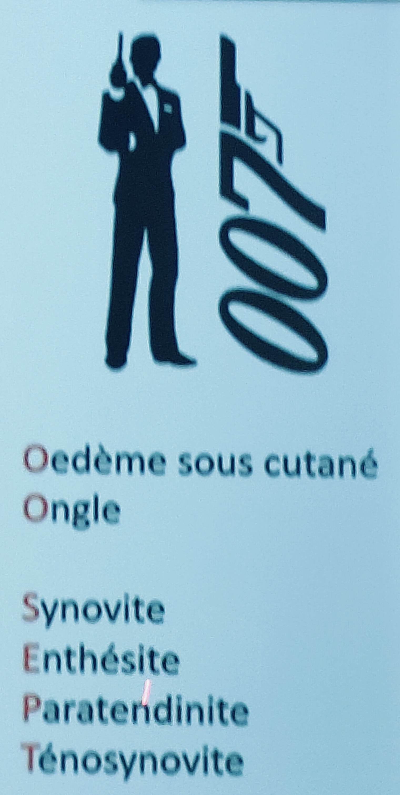

# Rhumatisme psoriasique

Moyen mnémotechnique pour les anomalies des dactylites du rhum pso :

 

[Imagerie dans le pré rhumatisme psoriasique ](Rhumatisme%20psoriasique/Imagerie%20dans%20le%20pr%C3%A9%20rhumatisme%20psoriasique%2018345f5988be8057bc01ef0fb6560638.md)

Traitements :

- Axial = biothérapies
- Périph = cs dmards puis biothérapies si inefficace
- anti il 23 marche le mieux, 12/23, et aussi  il-17 et anti TNF