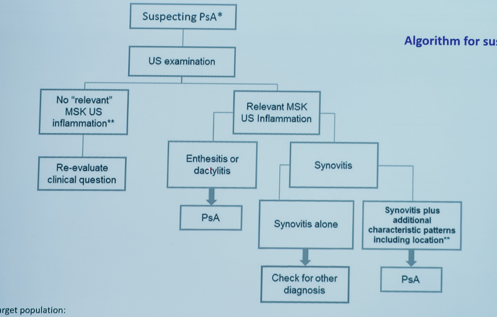

# Imagerie dans le pré rhumatisme psoriasique

## Présentation de Philippe 22/01/2025

**Échographie :**

 15% des gens qui ont du psoriasis cutané ont des atteintes échographiques infra cliniques (enthesites et TS ++)

**Algorithme utilisation de l'échographie quand on suspecte un rhumatisme psoriasique** 
 

**IRM** :

Beaucoup de patients (55%) qui du psoriasis cutané sans arthralgies et qui ont une IRM inflammatoire vont développer un rhum pso en un an