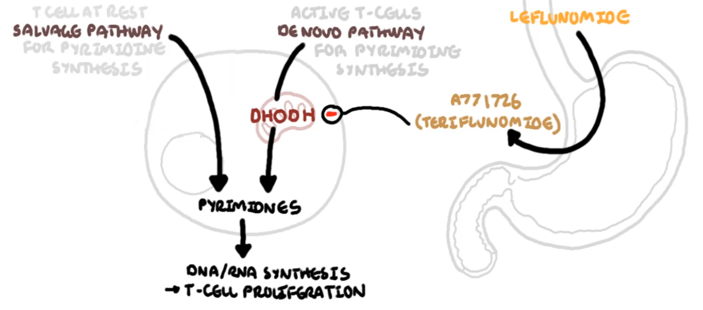
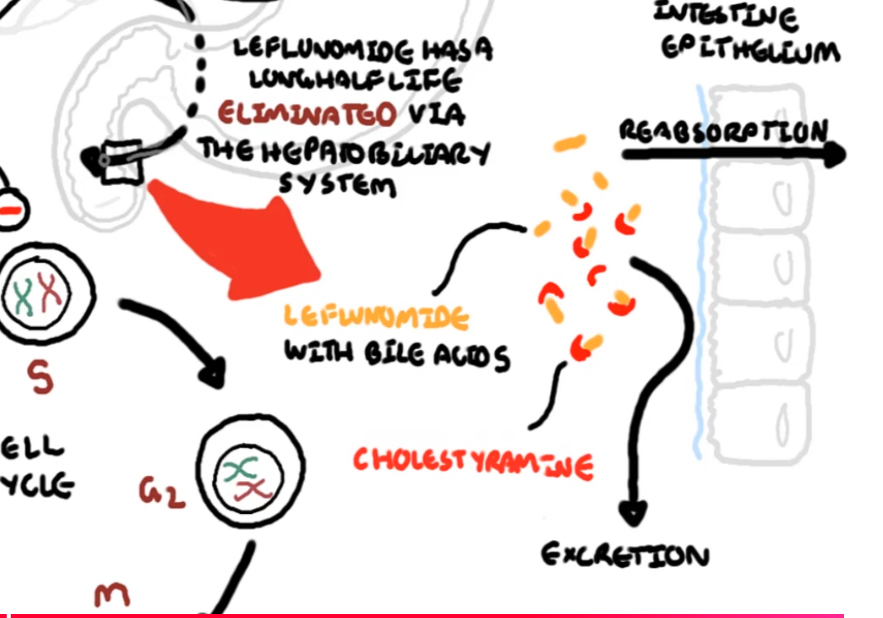

# Leflunomide

**Mécanisme d’action du leflunomide :**

Antimétabolite anti pyrimidique spécifiquement dans les lymphocytes T activés via son action sur une enzyme mitochondriale.

 
Le wash out à la cholestyramine (un séquestreur de sels biliaire) permet de rapidement capturer et éliminer le leflunomide en empêchant sa réabsorption. 

 