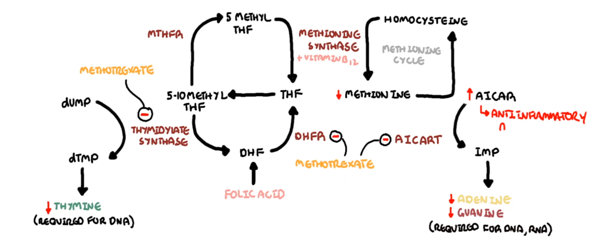

# Methotrexate

**Pharmacologie du methotrexate :** 

C’est un analogue de l’acide folique : il va prendre sa place et venir bloquer l’action de la DHFR (dihydrofolate reductase) dans le métabolisme des folates. 

Le métabolisme des folates est nécessaire à la synthèse d’ADN et d’ARN car permet la synthèse de thymine, d’Adenine et de guanine (bases nucléiques).

Donc le methotrexate est un anti-métabolique : il bloque la phase S du cycle cellulaire.

C’est pourquoi il a un effet immunosuppresseur : car les cellules immunitaires se divisent rapidement.

Mais il a aussi un effet anti-inflammatoire via son action sous sa forme polyglutamée intra cellulaire dans les cellules immunitaires sur l’enzyme AICAR transformase qui permet de produire de l’AICAR qui a un effet anti-inflammatoire via augmentation de l’adénosine extra cellulaire. 

 

Pourquoi est-ce que l’acide folique permet de minimiser la toxicité du MTX tout en préservant son efficacité sur la maladie auto immune ? 

1. L’acide folique donné par voie orale contourne la carence systémique en folates des tissus sains, mais n’élimine pas le MTX polyglutamé déjà fixé dans les cellules ni ne réactive les enzymes que le MTX bloque de manière compétitive dans les cellules immuno-inflammatoires.
2. Les doses de folates utilisées en rhumatologie sont faibles, distribuées à distance de la prise de MTX, et suffisantes seulement pour restaurer les voies de synthèse d’ADN des tissus sensibles sans saturer les voies où le MTX exerce son effet anti-inflammatoire (notamment la voie de l’adénosine).

**Ostéopathie liée au MTX**

Responsable de fractures de stress des membres inférieurs surtout (70%) atypiques perpendiculaires a la corticale osseuse 

⇒ il faut arreter le MTX et mettre des ttt anti osteoporotique anabolisant (teriparatide)