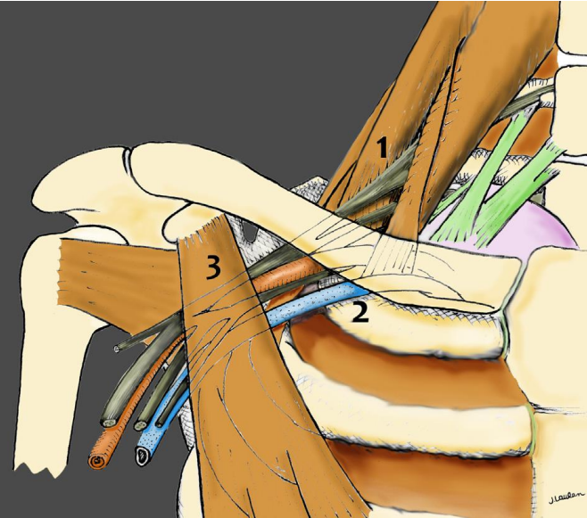

# Syndrome de la traversée cervico-thoraco-brachiale (STCTB)

## Définition
Syndrome canalaire **dynamique** lié à la compression intermittente des éléments du paquet vasculo-nerveux au niveau du défilé cervico-thoraco-brachial.
> Les symptômes dépendent de la structure comprimée : plexus brachial, artère sous-clavière ou veine sous-clavière.

# Anatomie – Physiopathologie

## Les 3 principaux sites de compression

### 1. Défilé interscalénique
**Limites :**
- Scalène antérieur
- Scalène moyen (± postérieur)
- 1ère côte

**Contient :**
- Plexus brachial
- Artère sous-clavière

### 2. Pince costo-claviculaire

**Limites :**
- Clavicule (haut)
- Muscle subclavier (avant)
- 1ère côte (bas et arrière)

### 3. Tunnel sous-coracoïdien (espace du petit pectoral)

Situé :
- sous le processus coracoïde
- derrière le petit pectoral
- devant le subscapulaire

 

# Épidémiologie

- Femme > homme (≈4:1)
- Survient surtout après **30–40 ans**

# Clinique

## Symptomes

Symptômes **positionnels**, favorisés par :
- élévation du membre supérieur
- port de charges
- conduite automobile
- sommeil

Atteinte unilatérale ou bilatérale

**Manifestations neurologiques :** territoire +++ **C8–T1 (ulnaire)** :
- douleurs pseudo-radiculaires
- paresthésies / hypoesthésie
- déficit moteur (plus rare)
- diminution/abolition des ROT (rare)

**Manifestations artérielles :**
- sensation de bras mort
- douleurs / crampes
- fatigabilité

**Manifestations veineuses :**
- œdème
- acrocyanose

# Complications

Peu fréquentes 
- thrombose veineuse
- ischémie artérielle

⚠️ Souvent associées à un trouble de la coagulation.

Association fréquente :
- syndrome du canal carpien
- **Double Crush Syndrome**
  
# Examen clinique

## Manœuvres

- Roos = chandelier (le meilleur test) : position en RE3 (chandelier) et demander d'ouvrir/fermer les mains 50 fois => positif si reproduit les signes neuro / veineux ou artériels (la main se recolore moins vite)
- Wright : lever le bras, palper le pouls radial et noter l'angle d'abduction auquel il disparaît
- Adson : en actif élévation menton, inspiration et rotation homolatérale de la tête + palper le pouls radial

Limites :
- sensibilité et spécificité faibles
- abduction/rétropulsion rarement standardisées

### Sensibilisation des tests

- rotation cervicale (mise en tension des scalènes)
- inspiration profonde ou bloquée (élévation de la 1ère côte)

# Examens complémentaires

## Examen de référence

### Écho-Doppler dynamique +++

Réalisé avec manœuvres positionnelles.

Permet de montrer :
- diminution du calibre vasculaire
- augmentation de la vitesse du flux
- compression dynamique

## Radiographies

- rachis cervical
- recherche de côte cervicale
- apex pulmonaire

## Angioscanner

Intérêt :
- localisation de la compression
- quantification du rétrécissement

Limite :
- ne visualise pas correctement les nerfs

## IRM

Visualise :
- plexus brachial
- artère
- veine

Mais l'étude dynamique est moins performante.

# Traitement

## Première intention (toujours)

Rééducation + réadaptation

Objectifs :
- correction posturale
- ouverture des défilés
- travail des muscles scapulaires
- étirements
- adaptation des activités

## Autres options

- injections de toxine botulique (cas sélectionnés)
- chirurgie

### Indications chirurgicales

- échec du traitement conservateur
- complication aiguë (thrombose, ischémie)