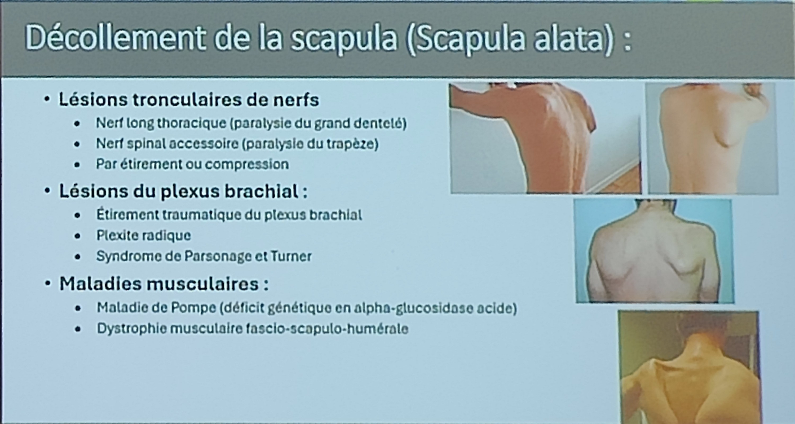

# Épaule

**Scapula Alata :** 

- Décollement de la scapula, exacerbé lorsque on pousse contre un mur
- Étiologies :
 

- Enmg pour distinguer origine nerveuse ou musculaire et pronostic en cas d’origine nerveuse

Dyskinésie scapulaire (terme générique) :

- Anomalies positionnelles ou de mouvement de la scapula attribuées aux dysfonctionnement des stabilisateurs de la scapula

**Syndrome de personnage Turner :**

Y penser devant douleur épaule aiguë aux urgences ! 

Traitement = corticothérapie 1mg/Kg, rééducation 
 
