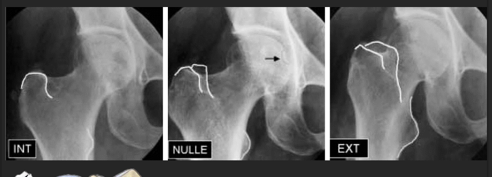
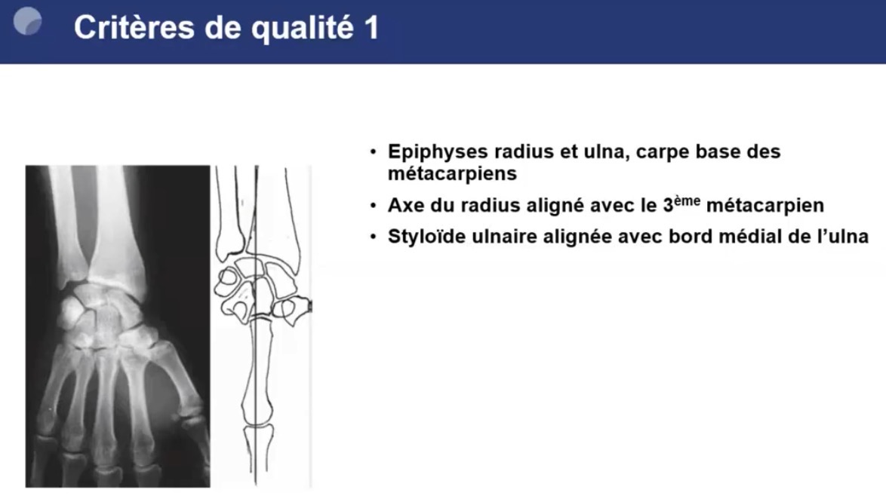
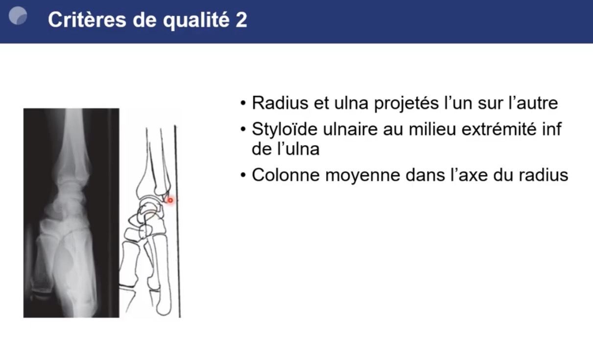
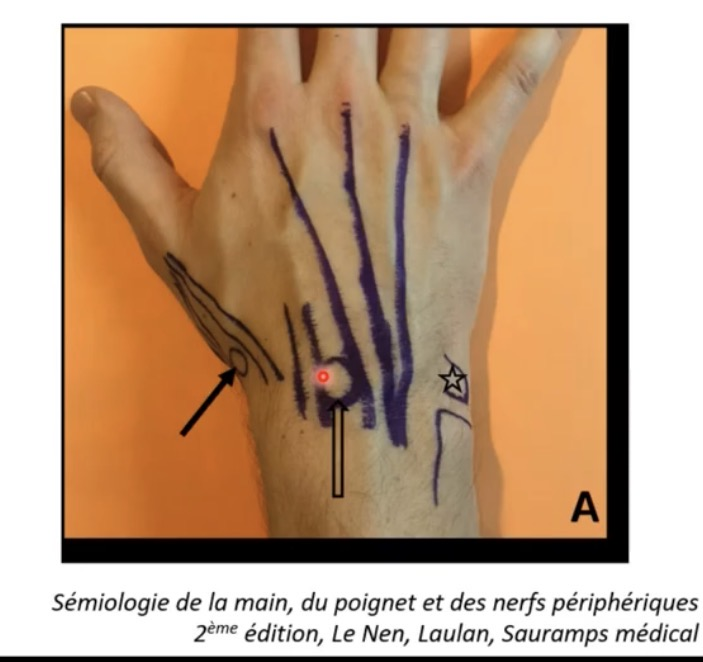
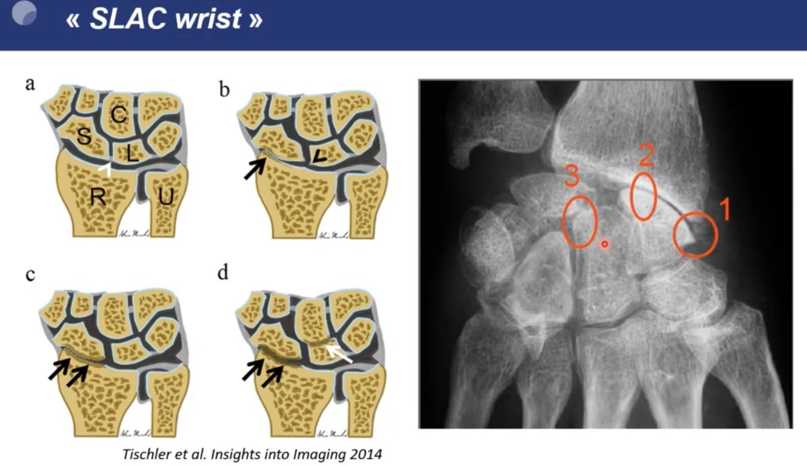

 

 
<h1>Hanche</h1>
 

## Clichés à faire :

- Bassin de face (15° de rotation externe)
- Hanches bilatérales de face (15° de rotation externe) + faux profil de Lequesne
  
### Cliché de hanche de Face

**Utilité :** Permet de voir le versant antérieur de l’interligne, ainsi que le toit du cotyle 

**Critères de qualité :** 

1. Bassin visible en totalité (L4 et crêtes iliaques en haut,
massifs trochantériens en bas)
2. Bassin symétrique : 
    1. superposition de l'axe des épineuses et du sacrum
    avec la symphyse pubienne
    2. trous obturateurs
    symétriques
3. Antéversion bien corrigée (15°) 
    1. Cols fémoraux bien "déroulés"
    2. Grands trochanters bien dégagés en position externe
    3. Petits trochanters barrés par les corticales internes des
    diaphyses fémorales

**Aspect normal :** 

- L’interligne normal est plus large à l’extérieur qu’à l’intérieur

**Coxométrie :** 

- Angle cervico-diaphysaire - normale < 135 à 140° sinon coxa valga :
    
    C= centre de la tête fémorale
    D= centre de la diaphyse
    C’= intersection des lignes passant par C (axe du col) et D ( axe de la diaphyse
    
- Couverture externe de la tête fémorale (**N > 25°**) :
    - Angle VCE
    - Verticale/Centre tête fémorale/point Externe du toit du cotyle
- Obliquité du toit du cotyle (**N < 10°**)
    - Angle HTE
    - Horizontale/point interne du Toit du cotyle/point Externe du toit du cotyle

**Signe de subluxation dans le cadre d’une dysplasie de hanche = rupture du cintre cervico-obturateur :** 

### Faux profil de Lequesne

**Utilité :** Etude du versant supéro-externe de l’interligne

**Critères de qualité :** 

1. Le col se superpose au grand trochanter
2. Petit trochanter légèrement saillant 
3. On pourrait faire passer la taille d’une petite tête fémorale entre les 2 
    
    
    

**Aspect normal :** 

Le pincement est souvent plus précoce sur cette incidence : 

- souvent antéro-supérieur.
- parfois postérieur

Le gradient de l’interligne articulaire est mieux visible sur cette incidence pour dépister un pincement antéro-supérieur débutant : 

- l’interligne s’aggrandit régulièrement de sa partie
postérieure à sa partie antérosupérieure
    
    ⇒ Un interligne sans gradient en faux profil est déjà pathologique, signifiant un
    début de pincement antérosupérieur= signe de l’égalisation des interlignes.
    
    ⇒ On peut aussi comparer le gradient du faux profil à celui du côté controlatéral
    

- Couverture antérieure de la tête (**N > 25°**)
    - Angle VCA
    - Verticale/Centre de la tête/point antérieur du toit du cotyle
    

## **Types d’ostéophytose :**

- En collerette = au pourtour de la tête fémorale avec une ostéophytose marginale céphalique
- Péri-fovéale (fovéa = dépression dans la tête qui correspond au point d'attache pour le ligament rond)
- De l’arrière fond de l’acetabulum = double fond
- Aux pourtours de l’acetabulum

## Formes cliniques

### Formes primitives

#### Coxarthrose débutante

Le pincement est souvent :
-   Discret
-   Antéro-supérieur ou postérieur, donc **non visible sur le cliché de face dans 1/3 des cas**
-   Ou totalement absent (**8 % des cas**)
→ Il faut donc rechercher un **interligne iso-épais** sur le faux profil de Lequesne. 

L'ostéophytose, elle, est présente dans **90 % des cas**, même en cas d'arthrose débutante :
-   Péri-fovéale +++ (**58 %**)
-   Double fond +++ (**52 %**)

#### Formes selon la localisation du pincement

D'après la coupe frontale de hanche :
-   Supéro-externe
-   Supéro-intermédiaire
-   Supéro-interne
-   Interne
-   Axial

Sur les autres incidences :

-   **Antéro-supérieure**
-   **Postérieure**, primitive ou secondaire à une protrusion acétabulaire ou une rétroversion du col

### Anomalies d'architecture

#### Dysplasie de hanche

→ Défaut de couverture — cause de **30 à 50 %** des coxarthroses.

| Paramètre | Hanche normale | Hanche dysplasique |
| --- | --- | --- |
| Face — Couverture externe (VCA) | ≥ 20° | < 20° |
| Face — Obliquité du toit (HTE) | ≤ 13° | > 13° |
| Face — Angle cervico-diaphysaire (CC'D) | ≤ 142° | > 142° |
| Faux profil — Couverture antérieure (VCA) | ≥ 20° | < 20° |

Une indication chirurgicale conservatrice est possible si le stade est peu évolué (stade I) chez un patient « jeune » :

-   Butée cotyloïdienne
-   Ostéotomie fémorale de varisation/valgisation
-   Ostéotomie pelvienne (péri-acétabulaire ou supra-acétabulaire)

#### Subluxation congénitale

-   Rupture du cintre fémoro-acétabulaire
-   Souvent séquelle d'une luxation congénitale de hanche réduite dans l'enfance
-   Rare dans les pays développés

#### Conflit fémoro-acétabulaire

→ Conflit se manifestant en flexion > 80°.

**Clinique :**

-   Typiquement le jeune sportif, avec des douleurs inguinales intermittentes ; examen et clichés standards souvent non concluants
-   Douleur reproduite à 80° de flexion/rotation interne de la cuisse, alors que la flexion pure dans l'axe reste indolore jusqu'à 120°

**Imagerie**, on distingue :
-   **Effet Came** : tête fémorale non sphérique
-   **Effet tenaille** : excès de couverture par l'acétabulum
-   Forme **mixte** (association came + tenaille)

#### Protrusion acétabulaire

→ Profondeur excessive du cotyle : débord de l'arrière-fond cotyloïdien en dedans de la ligne ilio-ischiatique.

|     | Coxa profunda | Protrusion acétabulaire |
| --- | --- | --- |
| Homme | 0–3 mm | > 3 mm |
| Femme | 0–6 mm | > 6 mm |

### Coxarthrose destructrice rapide

**Clinique :**

-   Douleur brutale et intense, à recrudescence nocturne, contrastant avec une arthrose peu évoluée radiographiquement
-   Doit faire éliminer une coxite septique ou microcristalline : CRP +++, échographie ± ponction, ou IRM

**Imagerie :**

-   Pincement progressant de **2 mm/an** (ou > 50 % de l'interligne)
-   Absence d'ostéophyte
-   Clichés à répéter à 3–6 mois

### Formes secondaires / diagnostics différentiels

-   **Mécaniques** : post-traumatique, inégalité de longueur des membres inférieurs (ILMI) > 3 cm
-   **Rhumatisme inflammatoire** : spondylarthrite ankylosante (SPA), polyarthrite rhumatoïde (PR)…
-   **Microcristallin** : chondrocalcinose
-   **Autres** : ostéonécrose épiphysaire, maladie de Paget
-   **Secondaires à des affections neurologiques** (myopathies, polyomyélite antérieure aigue) 

#### Ostéonécrose épiphysaire

-   **Contexte évocateur :** post-traumatique, corticothérapie, alcool, hypertriglycéridémie, VIH, drépanocytose, troubles de la coagulation, barotraumatisme, maladie de Gaucher, grossesse
-   **Clinique :** douleurs mécaniques ou mixtes, d'apparition brutale ; examen clinique peu spécifique
-   **Diagnostic :**
    -   IRM : liseré épais et sinueux, en hyposignal T1, concave vers le cotyle, délimitant la zone de nécrose ; parfois « double contour » en T2 Fat-Sat
    -   Radiographies (stade avancé) : fracture sous-chondrale, effondrement de la tête fémorale

#### Chondrocalcinose

-   Liseré de calcification
-   Pincement global ou supéro-externe
-   Multiples géodes sous-chondrales
-   En cas d'arthropathie destructrice :
    -   Ostéophytose absente, ou au contraire massive et affrontée
    -   Destruction cartilagineuse et osseuse : aplatissement de la tête, protrusion acétabulaire sur le versant opposé

#### Spondylarthrite ankylosante

-   Sujet jeune
-   Coxite bilatérale
-   Pincement coxofémoral **global et concentrique**, surtout marqué en médial
-   Ostéophytose péricéphalique et péri-fovéale **généralement absente**
-   Géodes du toit de l'acétabulum
 

 
<h1>Genou </h1>
 
  
## Critères radiologiques de Kellgren et Lawrence

**0 - Radio Normale**
**1 - Très léger ostéophyte ou pincement**
**2 - Ostéophytes**, pincement de l’interligne articulaire
**3 -** Ostéophytes de moyenne importance, pincement articulaire **avec sclérose sous chondrale**
**4 - Gros ostéophytes, pincement complet de l’interligne, sclérose sévère, déformation**

Souvent l’os sous chondral médial est plus condensé que le latéral c’est normal ⇒ vérifier qu’on voit les travées osseuses : pas de condensation sous chondrale si on voit la trame 

## Dysplasie femoro patellaire :

Signe du croisement sur genou de profil (ligne du fond de la trochlée qui vient croiser la ligne du condyle fémoral) 

Défilé femoro patellaire à 30° de flexion 

 
<h1>Digitale  </h1>
 

 
<h1>Epaule </h1>
 

## Omarthrose excentrée

**Se définit radiologiquement par :**

- Un pincement de l’ESA.
- Une arthropathie sous acromiale avec remodelage du tubercule majeur.

**Ses signes peuvent se compliquer par :**

- La constitution d’une néoarticulation acromio humérale.
- Une chondrolyse gléno-humérale

**Classification de HAMADA omarthrose centrée :** 

Stade 1 ESA normal (> 6mm)

Stade 2 ESA diminué (< 6mm)

Stade 3 = stade 2 + 
Acétabulisation de la face inférieure de l’acromion

Stade 4A = stade 2 + 
Pincement glénohuméral sans acétabulisation de la face inférieure de l’acromion

Stade 4B = stade 2 + 
Pincement gléno huméral
Acétabulisation de la face inférieure de l’acromion

Stade 5 = stade 2 + 
Nécrose massive de la tête humérale

## Omarthrose centrée

**Se définit par :**

- Une ostéophytose céphalique humérale au bord antéro-inférieur de l’articulation
- Un espace sous acromial
respecté.
- Un pincement tardif de l’interligne
gléno-huméral, qui se voit mieux sur le cliché en rotation externe

## Classification Samilson omarthrose centrée

 
<h1> Poignet </h1>
 

 
<h1> Poignet </h1>
 

## Critères de qualité des radios du poignet

## Arthrose radio-scaphoïdienne

Principalement causes secondaires par ordre de fréquence : 

1. Traumatiques : 
    1. Instabilité scapho-lunaire = **SLAC wrist** secondaire à la rupture du ligament scapho-lunaire
    2. Pseudarthrose ou ostéonécrose scaphoïdienne post traumatique = **SNAC wrist** 
2. Microcristalline = **SCAC wrist** pour scaphoïd chondrocalcinosis advanced collapse
3. Microtraumatique

### SLAC Wrist

Clinique : 

- rechercher un atcd de traumatisme
- Au stade precoce il peut avoir
    - une synovite
    - la palpation du lunatum est douloureuse entre l’extenseur radial du carpe et commun des doigts.
- Testing de l’instabilité scaphoïde lunaire :
    - Ballotement scapholunaire
    - Manœuvre de Watson

**Aspect radiographique = Diastasis scapholunaire supérieur à 3 mm**, associé à une altération dégénérative qui varie selon le stade évolutif :

- Stade I : bec de la styloïde radiale, sclérose et rétrécissement de l'espace articulaire entre le scaphoïde et la styloïde radiale
- Stade II : pincement radio scaphoïdien
- **Stade III :** ostéosclérose et pincement de l'espace articulaire **entre le lunatum et le capitatum**, **avec possible migration proximale du capitatum dans l'espace créé par la dislocation scapholunaire.**

**Clichés à demander pour rechercher diastasis scapholunaire  :** 

- Cliché en inclinaison ulnaire
- Cliché avec poing fermé
- Diastasis > 4mm en radio ou écho

→ Mêmes manœuvres en écho 

### SCAC wrist

**L'aspect est distinct dans l'arthrose secondaire à la chondrocalcinose =** absence de diastasis scapholunaire et « incrustation » du scaphoïde dans le radius + Ostéocondensation sous-chondrale intense, à limite nette

### SNAC wrist

Plus rare en rhumato

Plutôt ortho mauvaise consolidation ou osteonecrose du scaphoïde post traumatique

Aspect comme SNAC mais pas de pincement avec le pôle proximal du scaphoïde

 
<h1> Titre </h1>
 

