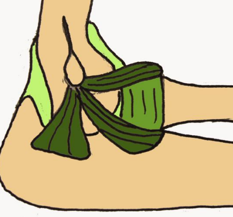
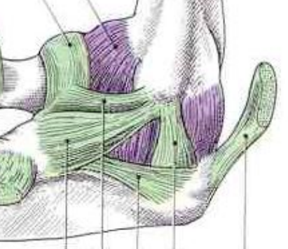
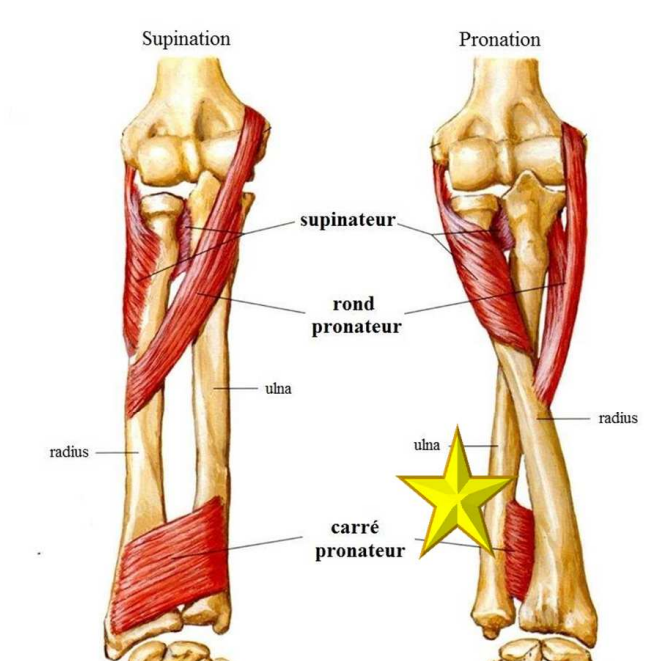
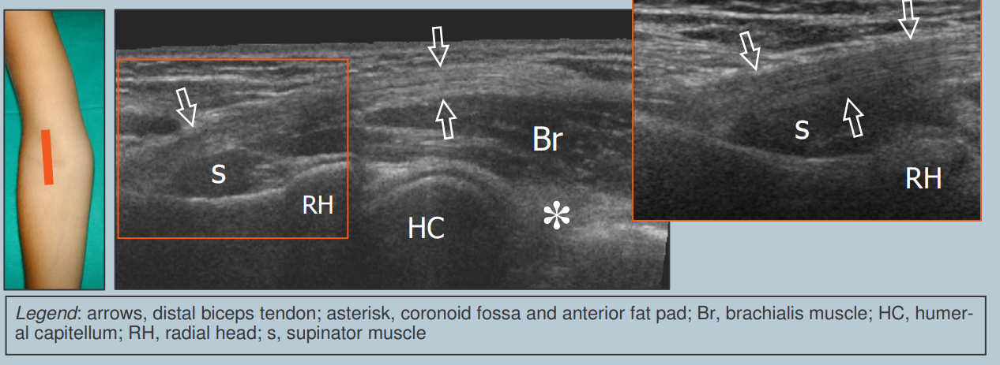
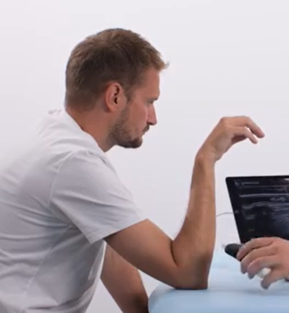
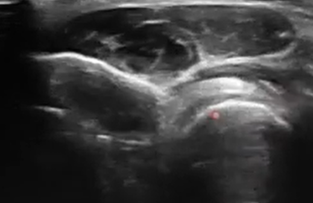
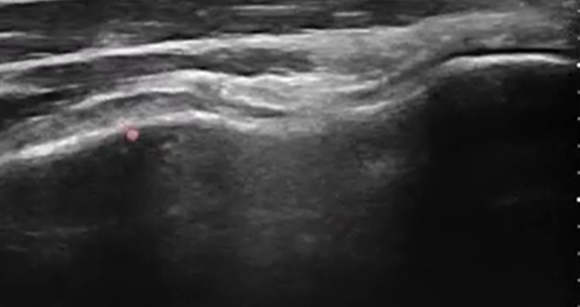

# Coude
## Rappels anatomiques

L’humérus possède une trochlée pour l’ulna et un capitulum pour la tête radiale

Fosse coronoïdienne = fosse dans laquelle le processus coronoïde de l’ulna va se loger en flexion, pourquoi “coronoïde” ? Car le processus coronoïde a une forme de bec de corneille. 
Il y a aussi une fossette radiale moins prononcée
 
 
Ligament collatéral latéral en 3 faisceaux : 
* Ligament collatéral ralatéral dial
* Ligament collatéral latéral ulnaire
* Postérieur

Ligament annulaire du radius
 
Ligament collatéral ulnaire :
* Eventail
* Faisceaux:
  * Antérieur
  * Moyen +++
  * Postérieur ++ – Arciforme (ligament de Cooper)
     
 
 
## Epicondylite latérale (Tennis elbow)
### 1. Physiopathologie & Anatomie

-   **Muscle principal atteint :** Court Extenseur Radial du Carpe (**CERC** / _Extensor Carpi Radialis Brevis_).
    
-   **Mécanisme :** Micro-traumatismes répétés lors de l'extension du poignet et de la supination.
    
-   **Terrain :** Sportifs (tennis = mouvement en fin du revers, sports de lancer, natation, escrime), mais surtout **professionnel** (dactylographie, coiffure, port de charges).
### 2. Diagnostic Clinique (Le "Trépied")

Le diagnostic est essentiellement **clinique**. La douleur est réveillée par :

1.  **Palpation directe :** Douleur exquise sur l'épicondyle latéral.
3.  **Manoeuvre de Maudsley :** Extension contrariée du 3ème doigt (sollicite spécifiquement le CERC).
4.  **Manoeuvre de Cozen :** douleur à l'extension du poignet contre résistance
5.  Douleur à la supination forcée

### 3. Examens Complémentaires
La place de l'imagerie est réservée aux formes atypiques ou résistantes au traitement initial.
-   **Radiographie standard :**

    * Souvent normale. Peut montrer des enthésophytes, tuméfaction des parties molles.
    * Diagnostics différentiels :
      * arthropathie huméroradiale, corps étrangers intra-articulaires ou de toute autre pathologie osseuse de voisinage (tumorale notamment).
      * Ostéome en regard de l'épicondyle latéral
    
-   **Échographie (Examen de référence) :** [Protocole épicondylite latérale échographie](Echographie/Epicondylitelateraleecho.md)
    
-   **IRM :** Réservée aux cas chroniques ou avant chirurgie pour éliminer un diagnostic différentiel.
    

### 4. Diagnostics Différentiels

-   **Radiculopathie C6 :** Névralgie cervico-brachiale.
    
-   **Syndrome du nerf radial :** Compression du nerf interosseux postérieur dans l'arcade de Fröhse (douleur plus distale).
    
-   **Plica synoviale :** Pathologie intra-articulaire du coude.
    

### 5. Prise en Charge Thérapeutique

|  | **Traitement** |
| --- | --- |
| **Repos** | Repos relatif (pas d'immobilisation stricte), adaptation du poste de travail. Orthèse du poignet. |
| **Médical** | Antalgiques, AINS notamment en topiques locaux ( dans les 4 premières semaine). Injection de PRP |
| **Rééducation** | 1) Auto-exercices 2) Kiné avec protocole de Stanish (travail excentrique) |
| **Chirurgie** | Rare (< 5% des cas). Désinsertion-réinsertion ou peignage du tendon après 6 à 12 mois d'échec du traitement médical. |
## Rupture du tendon distal du biceps 
### Clinique

Traumatisme à la réception d'une charge lourde bras en flexion. Douleur vive et soudaine au pli du coude, parfois accompagnée d'un "clac" audible.

L'examen clinique est souvent très évocateur dès l'inspection.

-   **Inspection :** * **Signe de Popeye inversé :** Ascension du corps musculaire du biceps vers le haut du bras, créant un vide au-dessus du pli du coude.
    
    -   Ecchymose tardive à la face antérieure de l'avant-bras.
        
-   **Tests :**
    
    -   **Hook Test (Test du crochet) :** Impossibilité pour l'examinateur de crocheter le tendon distal avec le doigt au pli du coude (sensibilité/spécificité proches de 100 %).
        
    -   Déficit de force marqué en **supination** (perte de 40 à 50 %) et, dans une moindre mesure, en flexion (perte de 20 %).
 
    -   
### Imagerie

L'imagerie confirme le diagnostic et précise le degré de rétraction.  **Note :** Le diagnostic est avant tout clinique. L'imagerie sert surtout à ***éliminer une rupture partielle ou préchirurgical**.

#Échographie

**2 positions d'analyse échographique :**
1) Avant bras en extension et supination maximale, sonde en longitudinal sur l'insertion

    * **Piège échographique** : risque d’aspect **faussement hypoéchogène** si la sonde n’est pas parallèle (anisotropie) =>  essayer d'obliquer dans la peau la partie distale de la sonde pour éviter l'anisotropie.

3) Position du Cobra 
    *  Permet de bien voir l'enthèse et surtout sa portion distale dorsale
    
    * Flexion 90° et pronation maximale
    * Sonde en position latérale :
      * Se mettre d'abord au niveau du cartilage de la tête radiale en axial d'avant bras puis descendre sur le tendon pour une coupe longitudinale du tendon
      * On peut faire des mouvements de pronosupination pour une étude dynamique
      * ensuite l'étudier aussi en transversal
     
 

**Signes :** Absence du tendon dans sa gaine, présence d'un hématome ou d'un épanchement dans la gaine bicipitale.
    

#IRM (Examen de référence)

-   **Protocole :** Souvent réalisé en position **FABS** (_Flexed Abducted Supinated_) pour déplier le tendon et mieux voir l'insertion.
    
    -   **Rupture complète :** Solution de continuité du tendon avec rétraction du moignon tendineux.
        
    -   **Rupture partielle :** Amincissement ou hypersignal intra-tendineux sans interruption totale.
        
    -   **Mesure de la rétraction :** Cruciale pour la planification chirurgicale (distance entre la tubérosité radiale et le bout du tendon).
        