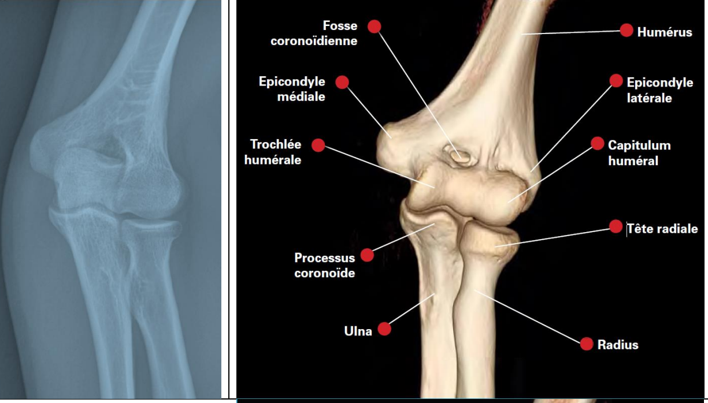

# Coude
## Rappels anatomiques

L’humérus possède une trochlée pour l’ulna et un capitulum pour la tête radiale

Fosse coronoïdienne = fosse dans laquelle le processus coronoïde de l’ulna va se loger en flexion, pourquoi “coronoïde” ? Car le processus coronoïde a une forme de bec de corneille. 

Il y a aussi une fossette radiale moins prononcée
## Epicondylite latérale (Tennis elbow)
### 1. Physiopathologie & Anatomie

-   **Muscle principal atteint :** Court Extenseur Radial du Carpe (**CERC** / _Extensor Carpi Radialis Brevis_).
    
-   **Mécanisme :** Micro-traumatismes répétés lors de l'extension du poignet et de la supination.
    
-   **Terrain :** Sportifs (tennis = mouvement en fin du revers, sports de lancer, natation, escrime), mais surtout **professionnel** (dactylographie, coiffure, port de charges).
### 2. Diagnostic Clinique (Le "Trépied")

Le diagnostic est essentiellement **clinique**. La douleur est réveillée par :

1.  **Palpation directe :** Douleur exquise sur l'épicondyle latéral.
3.  **Manoeuvre de Maudsley :** Extension contrariée du 3ème doigt (sollicite spécifiquement le CERC).
4.  **Manoeuvre de Cozen :** douleur à l'extension du poignet contre résistance
5.  Douleur à la supination forcée

### 3. Examens Complémentaires
La place de l'imagerie est réservée aux formes atypiques ou résistantes au traitement initial.
-   **Radiographie standard :**

    * Souvent normale. Peut montrer des enthésophytes, tuméfaction des parties molles.
    * Diagnostics différentiels :
      * arthropathie huméroradiale, corps étrangers intra-articulaires ou de toute autre pathologie osseuse de voisinage (tumorale notamment).
      * Ostéome en regard de l'épicondyle latéral
    
-   **Échographie (Examen de référence) :** [Protocole épicondylite latérale échographie](Echographie/Epicondylitelateraleecho)
    
-   **IRM :** Réservée aux cas chroniques ou avant chirurgie pour éliminer un diagnostic différentiel.
    

### 4. Diagnostics Différentiels

-   **Radiculopathie C6 :** Névralgie cervico-brachiale.
    
-   **Syndrome du nerf radial :** Compression du nerf interosseux postérieur dans l'arcade de Fröhse (douleur plus distale).
    
-   **Plica synoviale :** Pathologie intra-articulaire du coude.
    

### 5. Prise en Charge Thérapeutique

| **Phase** | **Traitement** |
| --- | --- |
| **Initiale** | Repos relatif (pas d'immobilisation stricte), adaptation du poste de travail. |
| **Médical** | Antalgiques, AINS (bref délai), **Infiltrations de corticoïdes** (efficaces à court terme mais risque de récidive à long terme). |
| **Rééducation** | **Gold Standard** : Protocole de Stanish (travail excentrique), Ondes de Choc (ODC). |
| **Chirurgie** | Rare (< 5% des cas). Désinsertion-réinsertion ou peignage du tendon après 6 à 12 mois d'échec du traitement médical. |