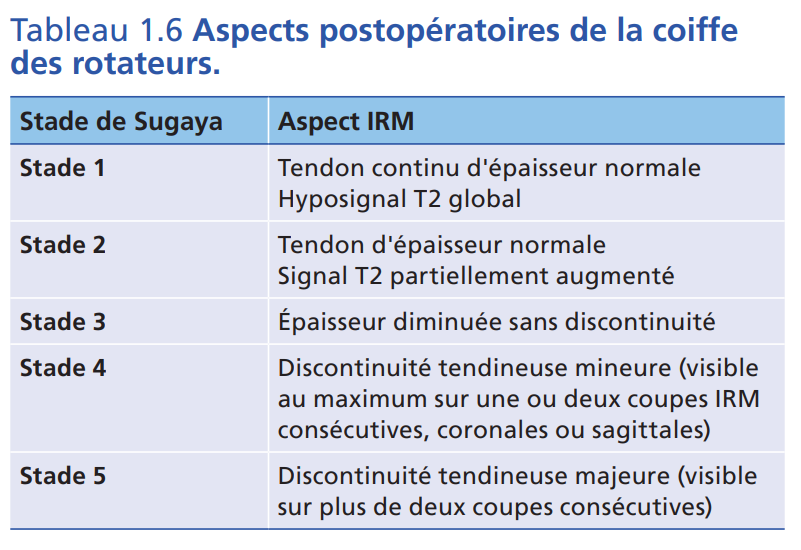

# Protocole échographie épaule

Propriétaire: quentin campeol

### Protocole jeune / tout venant

**Long biceps :**

- axial/transversal
- jusqu’à la jonction avec tendon du pectoral

**Sub-scapulaire :** 

- axial/transversal
- Regarder glissement sinon conflit antero interne
- Portion en bas musculaire, normal
- Plurifasciculé

**Région infra-épineuse** 

- Fosse infra-épineuse
- Echancrure spino-glénoïdienne
- Gléno-humérale voie postérieure
- Infra-épineux / petit rond

**Supra-épineux** 

**Signes de conflit sous acromial = antéro-supérieur :**

- Se mettre sur le ligament acromio-coracoïdien en coupe longitudinale
    - Bras qui pend en bas :  faire rotation interne/externe
    - En abdution à 90° : passer de rotation neutre à signe de patte
- Signe indirect = épaississement BSAD

**Articulation acromio-claviculaire :** 

- Coupe longitudinale :
    - Cross arm test pour rechercher :
        - Un diastasis
        - Une élévation > 1mm d’un os par rapport à l’autre
- Coupe transversale :
    - Voir « l’olive »
    - Mettre Doppler
- +/- Ligaments acromio-coracoïdiens :
    - Partir d’une coupe longitudinale
    - Aller à l’intérieur et pivoter la sonde
    - Les ligaments trapézoïdes et conoïdes sont juste en dessous du pédicule artério-veineux

Si on ne trouve rien ⇒ aller plus loin : 

- Enthesopathie insertion deltoïde sur acormion
- Syndrome de Velpeau :
    
    [Syndrome canalaire de l’espace quadrilatère de Velpeau ](Protocole%20%C3%A9chographie%20%C3%A9paule/Syndrome%20canalaire%20de%20l%E2%80%99espace%20quadrilat%C3%A8re%20de%20Vel%2030345f5988be801e8ae1e6fb65933ecf.md)
    

### Protocole pour patient avec omarthrose évoluée

Rester humble chez ce type de patient : rechercher uniquement une grosse rupture transfixiante

Proposer infiltration / visco  

Compléter par un arthroscanner à visée pré-chirurgicale

### Protocole pour coiffe suturée

**Grands principes :** 

- Différencier les épaules où la coiffe paraît fonctionnelle : **tendons présents et corps musculaires non dégénérés**, de celles où elle ne l'est plus : tendons largement rompus et/ou corps musculaires dégénérés
- Comprendre la chirurgie réalisée : notamment si ténotomie (section du long biceps) et/ou ténodèse (suture du long biceps dans la région intertubérositaire en enlevant sa portion intra-articulaire

**Protocole :** 

Classification de sugaya pour chaque tendon 

⇒ Epaisseur 

⇒ Continuité 

⇒ Caractère hypoéchogène 

Globalement : 

- Stade 1 = tendon continu d’épaisseur et échogénicité normale
- Stade 3 = épaisseur diminuée sans discontinuité
- Stades 4/5 = rupture mineur / majeure
 