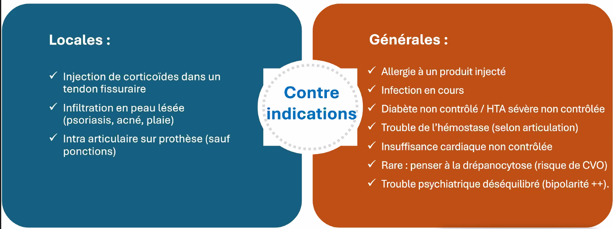

# Gestes sous écho en pratique

## Contre indications :
 

## Produits :

| **Corticoïdes injectables** | **Concentration et volume** | **Equivalence prednisone** | **Calcul équivalence pour toute l’ampoule** | **Persistance locale**  | **Indications**  |
| --- | --- | --- | --- | --- | --- |
| **Diprostène** (acétate + phosphate de bétaméthasone)  | 3mg acétate et 3.9mg phosphate de bétaméthasone | 1mg = 7.1mg | 7.1mg | 8 jours | intra et péri |
| **Kenacort retard** (Acétonide de triamcinolone)  | 40mg/1mL | 1mg = 1.25mg | 50mg | 10 jours | intra  |
| **Hexatrione** (hexacétonide de triamcinolone) | 40mg/2mL  | 1mg = 1.25mg  | 100mg | 30 jours  | intra |
| **Hydrocortancyl** (Acétate de prednisolone) | 125mg/5mL | 1mg = 1mg | 125mg | 8 jours | intra et péri + péridural |

## Aiguilles :

C’est surtout la longueur de l’aiguille qui compte, le diamètre ne change pas grand chose sur la douleur

Prendre des gros calibre pour les ponctions de liquide inflammatoire / infectieux

## Déroulé du geste :

Tout préparer avant pour pouvoir tout faire a une main 

Mettre du gel sur la sonde avant d'être en stérile 

Tube vert long = cytologie 

Tube petit rouge = bactériologie 

Prendre de l’alcool modifié pour stériliser les tubes avant de mettre dedans