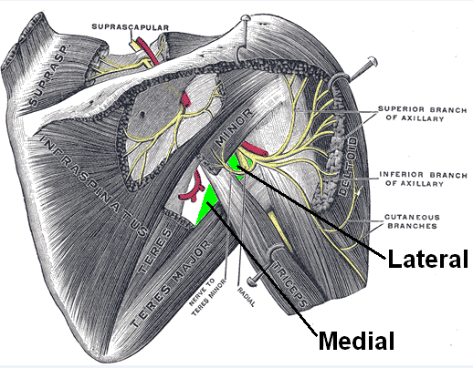

# Syndrome canalaire de l’espace quadrilatère de Velpeau

Propriétaire: quentin campeol

# Définition

**Conflit du nerf axillaire dans le quadrilatère de Velpeau** limité : 

- en haut par le **muscle petit rond**
- en bas par le **muscle grand rond**,
- en dedans par le **chef long du muscle triceps brachial**
- en dehors par l’humérus

 

Le nerf axillaire passe dans ce quadrilatère puis contourne ensuite par l'arrière le col chirurgical de l'humérus, sous le deltoïde.

**Population concernée :** jeunes pour la plupart et sportifs (baseball, tennis, volleyball, natation, musculation…). Le bras dominant est le plus souvent concerné.

# Symptomes :

### 1. Douleur

- **Siège :** Principalement à l'arrière de l'épaule, irradiant vers l'extérieur du bras et l'avant-bras.
- **Facteurs aggravants :** Mouvements d'élévation, d'écartement (abduction) et de rotation externe du bras.

### 2. Déficits moteurs (Faiblesse)

- **Muscle Deltoïde :** Faiblesse lors de l'élévation frontale, latérale et vers l'arrière.
- **Muscle Petit Rond :** Difficulté lors de la rotation externe du bras (coude au corps).
- **Triceps (Longue portion) :** Un déficit d'extension du coude suggère une atteinte plus haute (proximale) du nerf axillaire.

### 3. Signes sensitifs

- **Paresthésies :** Sensations de fourmillements ou engourdissements flous sur le sommet de l'épaule.
- **Hypoesthésie :** Diminution de la sensibilité localisée précisément sur le **"V" deltoïdien** (moignon de l'épaule).

### 4. Signe clinique spécifique

- **Point gâchette :** Douleur vive à la pression au niveau de **l'espace quadrilatère** (paroi postérieure de l'aisselle).