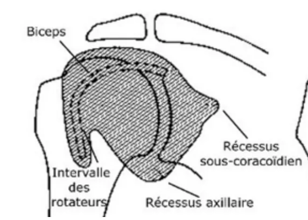

# Epaule IRM

Propriétaire: quentin campeol

**Séquences de références :** 

T2 Fat Sat 

T1 pour la trophicité musculaire 

**Plan de référence :** 

Sagittal pour voir la coiffe : 

- Vérifier qu’on a un bon angle de rotation neutre le la tête
- Pour cela la goutière du LB doit être entre 0 et 2h sur une horloge

Pour le long biceps = Plan Axial 

**Protocole :** 

1. Regarder les tendons : 
    1. En place ? 
        1. Notamment LB dans la gouttière
    2. Continus ?
        1. Fissure 
        2. Rupture superficielle/profonde/transfixiante
2. Regarder le labrum : 
    1. Remanié ?
    2. Attention il faut une Arthro-IRM pour conclure à fissuration du labrum 
3. Regarder les articulations : 
    1. Gléno-humérale 
    2. Sous-acromiale 
    3. Acromio-claviculaire
4. Regarder les muscles sur le T1 (trophicité musculaire)

**Récessus normaux de la gléno-humérale :** 

 