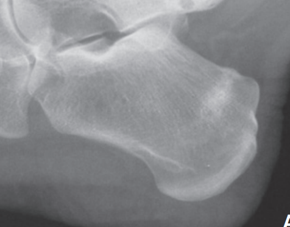
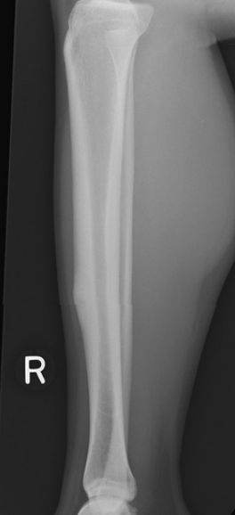
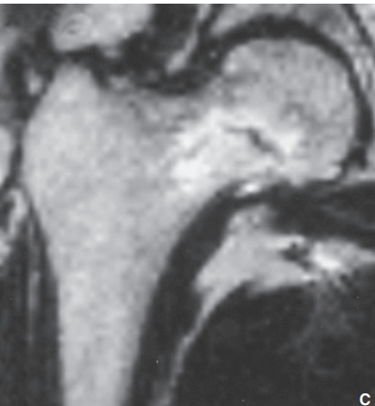
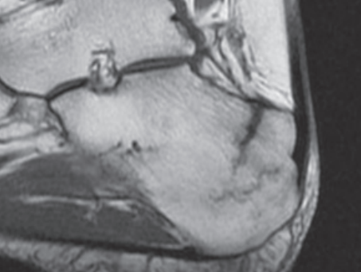

# Imagerie des fractures de contrainte
## Localisation des fractures de contrainte 
Principalement en zone portante : 
- bassin
- membres inférieurs
- rachis => Pédicules => listhésis
- sacrum
Au niveau de l'os la règle = interruption des lignes de force : 
- Diaphyse des os long :
  - Bord médial du tiers proximal du tibia
  - Diaphyse des métatarses, mais aussi sous le cartilage toujours perpendiculaire aux lignes
- Jonction tête-col interne du fémur, perpendiculaire à corticale
- Au "col" du calcaneus

  
  
   
## Sémiologie radiologique 
**Formes corticales** = Apposition périostée et/ou épaississement endostéal, auxquels peut s’ajouter ensuite une clarté linéaire intracorticale, perpendiculaire à la diaphyse.
**Formes trabéculaires** (os du tarse, vertèbres, diaphyse et métaphyse des os longs) = bande d’ostéocondensation volontiers discrète et inconstante => la traduction d’un cal osseux, ce qui explique sa survenue tardive.

## Sémiologie IRM 
**Examen de référence !**
Plage mal limitée Hypo T1 Hyper T2 fat sat +/- visibilité de la fracture : 
- hyper T1 et T2 en cortical
- hypo T1 et T2 en médullaire
\

Attention ! chez le sportif, des images IRM peuvent être observées en l’absence de tout symptôme
 
## Scintigraphie
**Imagerie précoce** => dès les premiers jours 

Attention ! chez le sportif, des hyperfixations osseuses focales peuvent être observées en l’absence de tout symptôme

## IRM 
## Echographie 
Pour les localisations superficielles : tibia, métatarses
=> épaississement périosté, irrégularité corticale, un début de cal douloureux lors du passage de la sonde.