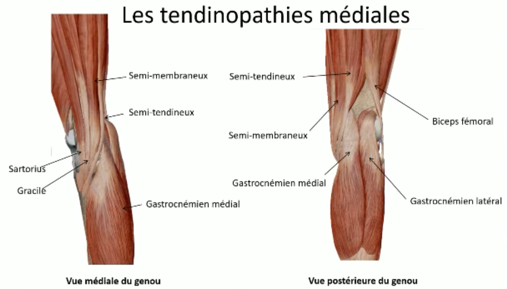
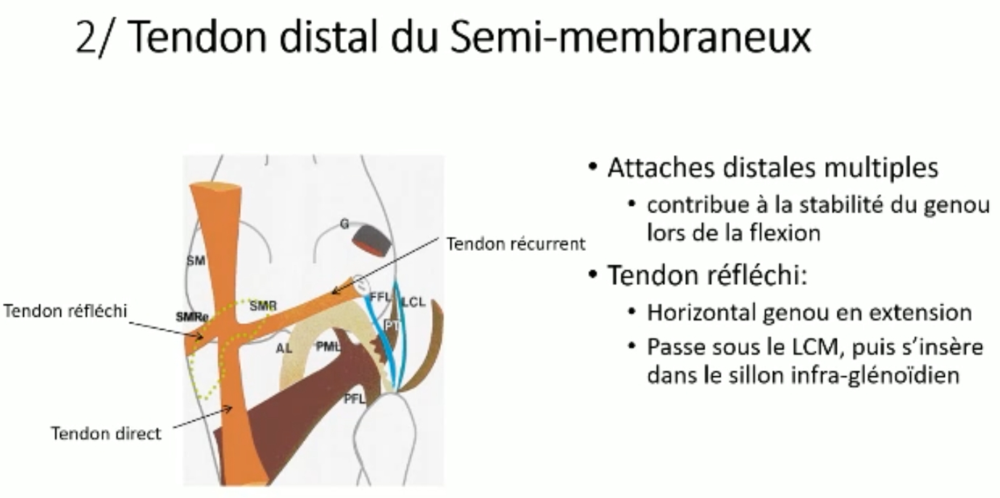
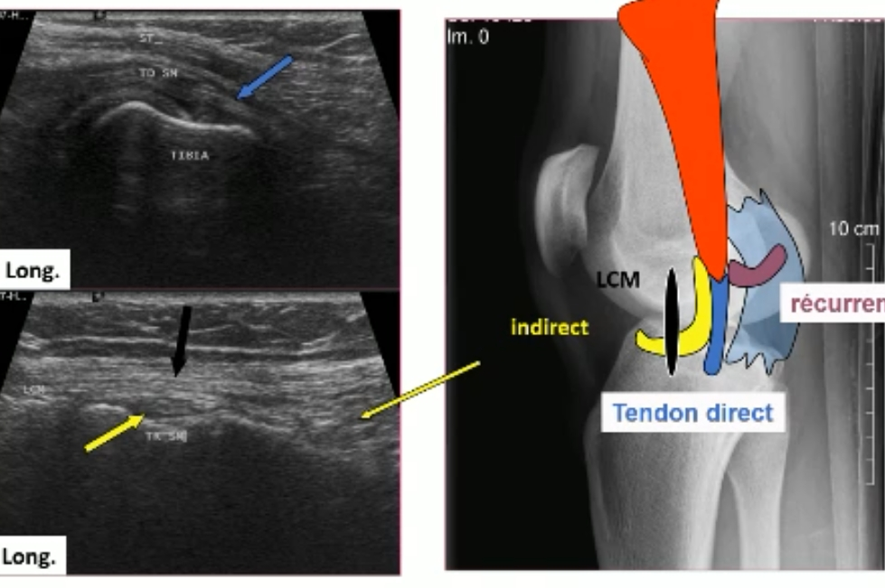
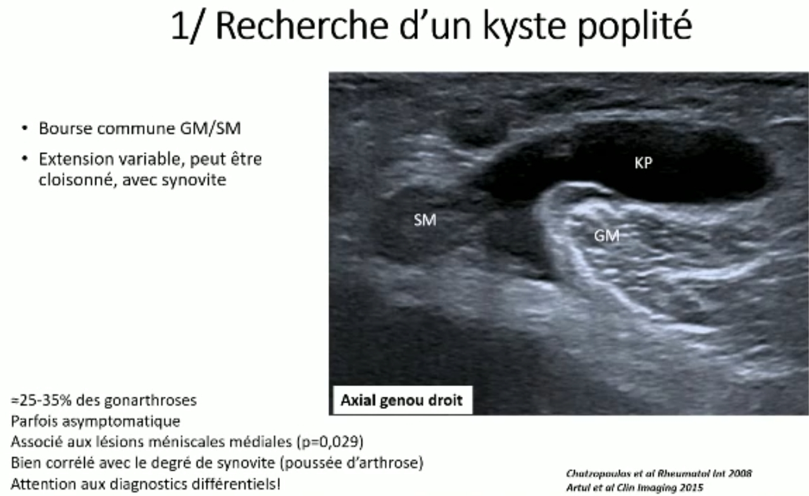

# Anatomie 

## Ligaments

### Pivot central
-   **LCA (Ligament Croisé Antérieur) :** S'oppose au tiroir antérieur du tibia sous le fémur + rotation interne
-   **LCP (Ligament Croisé Postérieur) :** S'oppose au tiroir postérieur (le plus robuste).
### En médial
-   **LCM (Ligament Collatéral Médial) :** Stabilisateur principal du valgus. Composé d'un plan superficiel et profond.
-   **PAPI (Point d'Angle Postéro-Interne) :** 4 éléments majeurs convergeant vers une zone de renforcement :
    -   **Plan profond du LCM :** Fibres postérieures.
    -   **Ligament Poplité Oblique (LPO) :** Expansion du semi-membraneux.
    -   **Corne postérieure du ménisque médial.**
    -   **Muscle Semi-membraneux :** Tendons direct, réfléchi et récurrent.
  
### En latéral
-   **LCL (Ligament Collatéral Latéral) :** Stabilisateur principal du varus. S'insère sur la tête de la fibula.
-   **PAPE (Point d'Angle Postéro-Externe) :** Triade de stabilité rotationnelle :
    -   **LCL.**
    -   **Tendon du muscle poplité.**
    -   **Ligament poplité-fibulaire.**
      
## Muscles et tendons

### Appareil extenseur

-   **Tendon quadricipital :** Au-dessus de la patella.
-   **Tendon patellaire :** Entre la pointe de la patella et la tubérosité tibiale antérieure (TTA).
### Muscles médiaux 
* **Patte d'oie = insersion sur la face antéromédiale du tibia**
  * Sartorius (loge antérieure de jambe qui croise depuis l'EIAS)
  * Gracile (le + médial des ischio-jambiers / muscle frêle et fin comparé aux autres)
  * Semi tendineux (ischio-jambiers)
    
* **Semi-membraneux = insertion principalement sur le condyle médial du fémur** Stabilisateur du PAPI

 

 

 
### Muscles latéraux et postérieurs

-   **TFL (Tenseur du Fascia Lata) :** Se termine sur le tubercule de Gerdy ; stabilisateur latéral en extension.
-   **Biceps Fémoral :** Se termine sur la tête de la fibula ; fléchisseur et rotateur externe.
-   **Poplité :** Stabilisateur profond, déverrouille le genou en début de flexion.
-   **Gastrocnémiens (Jumeaux) :** Stabilisateurs postérieurs, limitent l'hyperextension.
# Pathologie 
## Kyste poplité 
 
Diagnostics différentiels : 
  