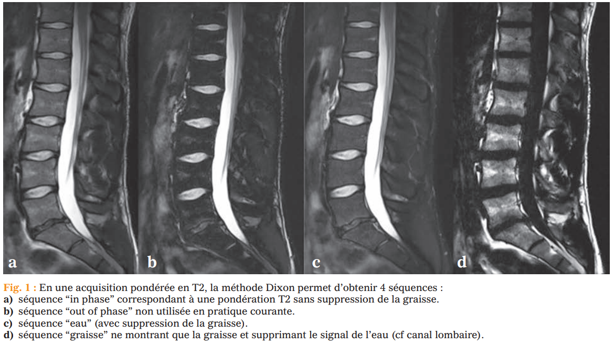
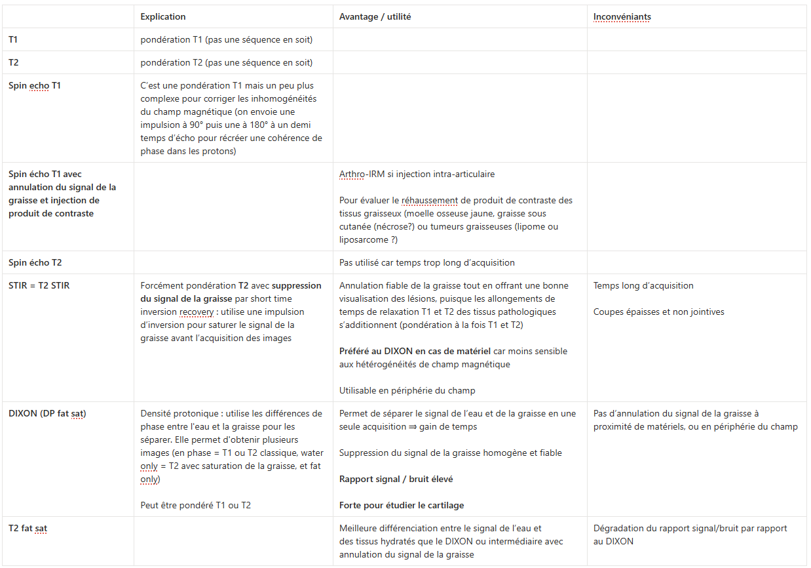

# IRM

Propriétaire: quentin campeol

# 1. Définition et explication de l’IRM

L’IRM utilise un **champ magnétique puissant** (généralement 1,5 ou 3 Tesla) et des **ondes radio** pour exciter les noyaux d’hydrogène (protons) présents dans le corps, surtout dans l’eau et la graisse. Quand ces protons reviennent à leur état d’équilibre, ils émettent un signal détecté par la machine, qui est transformé en image.

**Temps de répétition (TR) =** l’intervalle de temps entre **deux impulsions radiofréquences (RF) successives** qui excitent les noyaux d’hydrogène : 

- Un **TR court** (ex. : 300–700 ms) favorise la **pondération T1** (les tissus avec un T1 court, comme la graisse, récupèrent plus vite leur aimantation et apparaissent en hypersignal).
- Un **TR long** (ex. : 2000–4000 ms) favorise la **pondération T2** (les tissus avec un T2 long, comme l’eau, gardent leur signal plus longtemps et apparaissent en hypersignal).

**Temps d’écho (TE) =** C’est le temps entre **l’impulsion RF** et **la détection du signal** émis par les noyaux d’hydrogène.

- Un **TE court** (ex. : 10–30 ms) est utilisé pour les images **T1 ou DP**
- Un **TE long** (ex. : 80–120 ms) est utilisé pour les images **T2** (les tissus avec un T2 long, comme l’eau, émettent un signal plus longtemps et apparaissent en hypersignal).

## **2. Ce qu’on fait aux noyaux d’hydrogène**

### **a. Alignement dans le champ magnétique (B₀)**

- Les noyaux d’hydrogène (protons) se comportent comme de **petits aimants**.
- En l’absence de champ magnétique, leurs spins (moments magnétiques) sont **orientés aléatoirement**.
- Quand on les place dans un **champ magnétique puissant (B₀, ex. : 1,5 ou 3 Tesla)**, ils s’alignent **parallèlement ou antiparallèlement** à B₀, avec une légère majorité parallèle (état de basse énergie).

### **b. Excitation par onde radiofréquence (RF)**

- On envoie une **onde RF** à une fréquence spécifique (fréquence de Larmor), qui correspond à l’énergie nécessaire pour faire basculer les protons de leur état parallèle à un état **antiparallèle** (ou "excité").
- Résultat : Les protons **absorbent l’énergie** et basculent. Leur aimantation globale (vecteur M) quitte l’axe longitudinal (B₀) et acquiert une composante **transversale** (perpendiculaire à B₀).

### **c. Relaxation : Retour à l’équilibre**

Après l’excitation, les protons **reviennent à leur état d’équilibre** en libérant l’énergie absorbée. Ce retour se fait selon deux processus :

1. **Relaxation longitudinale (T1)** :
    - Les protons **reprennent leur alignement parallèle à B₀**.
    - Le temps caractéristique est **T1** (variable selon le tissu : court pour la graisse, long pour l’eau).
    - Pendant ce temps, ils **restituent de l’énergie** au milieu (d’où le signal détecté).
2. **Relaxation transversale (T2)** :
    - Les protons **perdent leur cohérence de phase** dans le plan transverse (à cause des interactions entre eux).
    - Le temps caractéristique est **T2** (toujours ≤ T1).
    - Le signal transverse **décroît** avec le temps.

## **3. Ce qu’on détecte**

### **a. Le signal IRM**

- Pendant la relaxation, les protons émettent un **signal électromagnétique** (onde RF) quand ils reviennent à leur état d’équilibre.
- Ce signal est **capté par des bobines réceptrices** placées autour de la zone à imager.
- L’intensité du signal dépend :
    - De la **densité de protons** (plus il y a d’hydrogène, plus le signal est fort).
    - Des **temps de relaxation T1 et T2** des tissus.
    - Des **paramètres TR et TE** choisis pour l’acquisition.

### **b. Construction de l’image**

- Le signal est **localisé spatialement** grâce à des **gradients de champ magnétique** (qui varient légèrement B₀ selon x, y, z).
- Un algorithme de **transformée de Fourier** convertit les signaux en une **image 2D ou 3D**.
- Selon les paramètres (TR, TE), on obtient des images **pondérées en T1, T2, ou DP**.

## **4. Résumé en 3 étapes**

1. **Alignement** : Les protons s’alignent avec le champ magnétique B₀.
2. **Excitation** : Une onde RF les fait basculer (création d’une aimantation transversale).
3. **Relaxation et détection** :
    - Les protons reviennent à l’équilibre (T1) et perdent leur cohérence (T2).
    - Leur signal est capté et transformé en image selon TR/TE :
        - On utilise des **TR/TE courts en pondération T1** pour que les différences de temps de relaxation longitudinale T1 entre les tissus dominent les contrastes de l’image
        - On utilise des **TR/TE longs en pondération T2** pour que les différences de temps de relaxation transversale T2 entre les tissus dominent les contrastes de l’image

# 2. Définition et explications des séquences en densité de protons (DP ou DIXON)

Les protons de l’**eau** et de la **graisse** ont des fréquences de résonance légèrement différentes
Après une excitation, leurs aimantations transversales tournent autour du champ magnétique B₀. à des vitesses légèrement différentes.

Résultat : Leur **phase relative** (synchronisation) change avec le temps.

On prend **deux images** à des moments précis qu’on appelle **TE pour temps d’écho** :

1. **Image "en phase" = in phase** :
    - TE choisi pour que l’eau et la graisse soient **alignées** (phase = 0°).
    - Signal = Eau + Graisse.
2. **Image "en opposition de phase"**  **= out phase** :
    - TE choisi pour que l’eau et la graisse soient **opposées** (phase = 180°).
    - Signal = Eau – Graisse.

En combinant ces deux images, on obtient :

- Une image **uniquement avec l'eau = water only**
- Une image **uniquement avec la graisse = fat only**

 

# **3. Séquences d’IRM musculo-squelettique**

 

# **4. Signal des tissus en fonction de la pondération IRM**

|  | **T1** | **T2** |
| --- | --- | --- |
| **Graisse** | Hyper | Hyper |
| **Oedème (= eau)** | Hypo | Hyper |
| **Ligaments** | Hypo | Hypo |
| **Cordon médullaire** | Iso | Hypo |
| **Nerfs spinaux** | Iso | Discret hyper par rapport aux muscles |
| **Moelle osseuse rouge** | Iso voire hypo | Iso voire hypo |
| **Moelle osseuse jaune** | Hyper | Hyper |
| **Abcès épidural** | Centre hypo, contour rehaussé après injection | Hyper très intense |
| **Disque intervertébral** | Hypo | Hyper |
| **Trait de fracture** | Hypo | Souvent hypo |
| **Synovite**  | Hypo T1 et se réhausse à l’injection |  |

**Fracture :**

- Trait de fracture hypoientense en T1 +/- T2
- Oedème intra osseux hyper T2
- Cal
- A distance remplacement par de la graisse donc hyper T1 hyper T2

**Différence entre synovite et épanchement en IRM ⇒ Il faut injecter et pondérer en T1 :** 

- Synovite se réhausse
- Alors que l’épanchement seul est hypo-T1