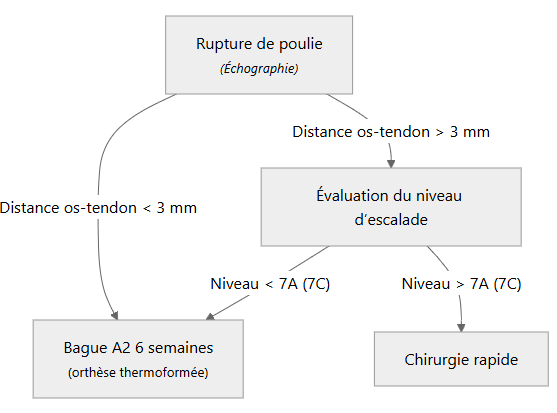

 
<h1>Plan d'interprétation des radiographies des mains </h1>
 

# 1. S'agit-il d'une : 
## 1.1 Arthropathie :
Atteinte articulaire (pincement ou déformations)
## 1.2 Ostéo-artropathie : 

## 1.3 Ostéopathie : 
### 4 signes radiologiques : 
- DEMINERALISATION DIFFUSE d’une main
- ACRO-OSTEOLYSE
- LACUNES & DESTRUCTION

# 2.1 Pour les arthropathies
## 2.1.1 Trois types à distinguer 
### "Dégénératif" = absence d'érosions 
#### Arthrose
* Signes positifs d'arthrose (pincement plutôt focal, ostéophytose, sclérose et +/- géodes mais mauvais signe)
* Pas de destruction articulaire sauf cas évolués
#### Arthropathies métaboliques 
* **Chondrocalcinose**
* **Rhumatisme à hydroxyapatite** 
### Rhumatismal inflammatoire = présence d'érosions
#### Polyarthrite rhumatoïde : 
* érosions isolées à limites floues
* déminéralisation osseuse en bandes
#### Rhumatisme psoriasique
* érosions et constructions
* limites plus nettes des érosions
### Destructeur 
#### PR sévère 
#### Rhumastisme psoriasique destructeur 
#### Arthrose destructrice
#### Goutte 
## +/- Arthropahies sans pincement 
### Jaccoud 
#### Lupus 
#### Rhumatismes post-streptrococciques
#### Idiopathique
### Géodes épiphysaires isolées

# 2.2) Pour les ostéopathies 
## Différentes ostéopathies à distinger 

### Hyperparathyroïdie
### Sarcoïdose
### Sclérodermie
### Algodystrophie 
### Goutte 
# 2.3) Pour les ostéo-arthropathies 

 
<h1>Atteintes des poulies </h1>
 

### Poulies sièges de ruptures = A2 et A4

### Poulie du doigt ressaut = A1