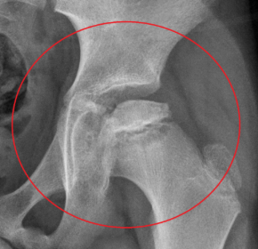

# Ostéochondrites ou ostéochondroses

Propriétaire: quentin campeol

### Définition :

L'**ostéochondrite** ou **ostéochondrose** est une anomalie de la croissance de l’os et du cartilage qui touche les enfants (5 à 12 ans majoritairement). C'est un groupe de maladies de causes inconnues, caractérisées par l’interruption de la vascularisation du noyau d’ossification primaire ou secondaire des os concernés.

### **En fonction de la topographie de l'atteinte :**

- Atteinte des plateaux vertébraux :
    
    [Maladie de Scheuermann](Ostéochondrites-ou-ostéochondroses/Scheuermann.md)
    
- Atteinte du membre supérieur :
    - Tête de l'humérus : maladie de Haas ;
    - Condyle externe de l'extrémité inférieure de l'humérus : maladie de Panner ;
    - Tête du radius : maladie de Brailsford ;
- Atteinte du membre inférieur :
    - Hanche : maladie de Legg-Calve-Perthes ;
    
    
    
    - Tubérosité tibiale antérieure : maladie d'Osgood-Schlatter ;
    
    
    
    - Corps de la patella : maladie de Köhler patellaire ;
    
    
    
    - Apex de la patella : maladie de Sinding-Larsen-Johanson ;
    
    
    
    - Calcanéum : maladie de Sever  ;
    
    
    
    - Naviculaire : maladie de Köhler-Mouchet ;
    
    
    
    - Tête du deuxième métatarsien  : maladie de Freiberg  ;
    
    
    
    - Sésamoïdes de l'hallux : maladie de Renander.
    
    