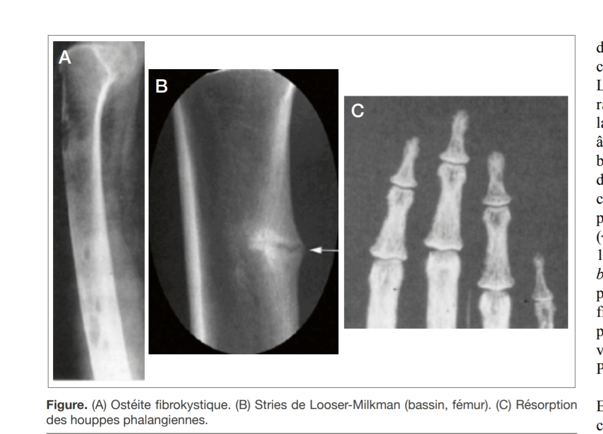
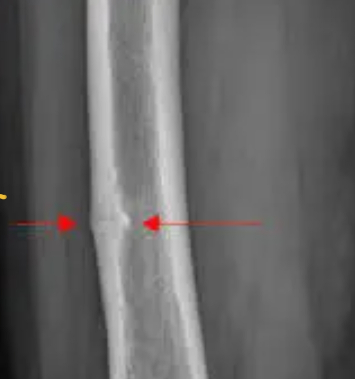

# Pathologies osseuses hors tumeurs

Propriétaire: quentin campeol

## Hyperparathyroïdie primaire :

⇒ cca 

⇒ osteopenie corticale (surtout tier proximal du radius qui est très corticalisé) 

## Ostéomalacie : 
- Stries de Looser-Milkmann, qui apparaissent sur les radiographies de certains patients victimes d'une mauvaise minéralisation du tissu osseux (ostéomalacie par exemple)
- Lignes claires, visibles sur la diaphyse (partie moyenne) des os longs, transversales (par rapport à l'axe de l'os et plus ou moins symétriquement disposées). Elles correspondent à des micro-déformations et à des fissures de l'os.
- A ne pas confondre avec fissure atypique sous anti résorbeurs
 

 
## Osteonecrose mécanique

- Different de aseptique
- Sur des reprises de sport
- Osteonecrose sous chondrale avec graisse entre le cartilage et la zone d’inflammation

## Thallasémies 

- Vertèbre en H