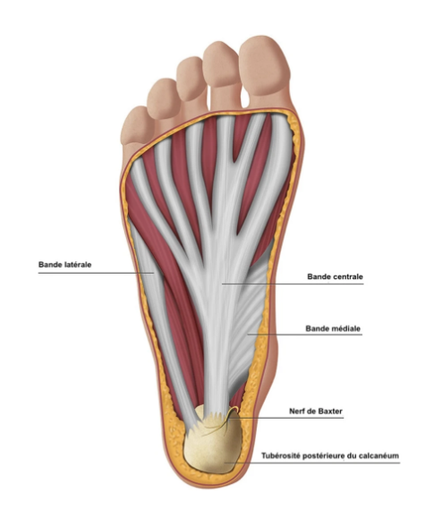
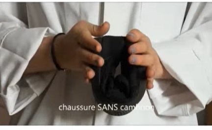
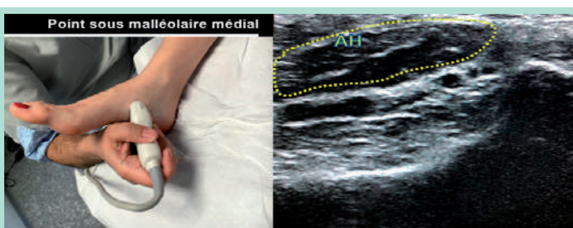
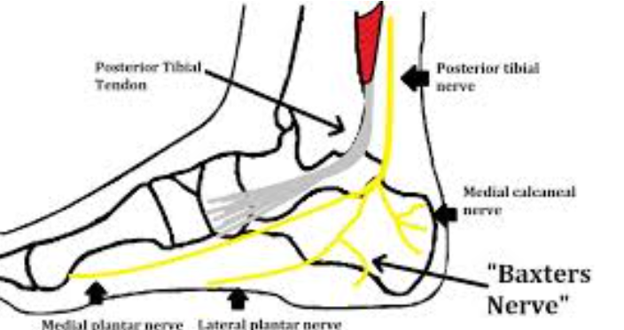

# Pied

## Métatarsalgies
[Métatarsalgies](Pied/Métatarsalgies.md)
## Talalgies
### Aponévrosite plantaire
**Anatomie** : 
* Bande centrale :
  - La principale ++++
  - Insertion proximale sur face médiale de la tubérosité du calca
  - Se divise en **5 bandelettes digitales**
    - Chaque bandelette :
      - se fixe sur la **base de la phalange proximale**
      - s’unit à la **gaine fibreuse des fléchisseurs**
* bande latérale :
  * Insersion proximale
    * Tubérosité du calcanéus (partie latérale)
  * Insersion distale :
    *  **Base du 5e métatarsien**
    *  Fascia du **muscle abducteur du 5e orteil**
* Bande médiale (osef un peu)

**Clinique**
  Douleur sous le talon au lever, à la marche, à la montée des escaliers
  Douleur à l'étirement passif, à la pression directe
  **Imagerie**
  Diagnostic clinique
  Echo peut aider si résistance au traitement
  **Traitement**
1. **Prise en charge des facteurs favorisants :** surcharge pondérale, marche et station debout prolongée (profession)
2. **Repos**
3. **AINS, glaçage**
4. **Talonnettes** de réhaussement (5 à 12mm)
5. **Chaussures adaptées** : semelles caoutchouc, talon pas plus de 5cm, présence d'un **cambrion** (si on arrive à plier en 2 la chaussure il n'y en a pas)
**Kiné :** stretching gastrocnémiens, MTP de la plante, ondes de choc
**Infiltrations** écho guidées : Corticoïdes, PRP
 

  
### Diagnostics différentiels 
\
**Concernant l'aponévrose :**
* **Épine calcanéenne** asymptomatique
* **Rupture partielle de l’aponévrose plantaire**
  -   Discontinuité focale des fibres
  -   Lacune hypoéchogène
  -   Hématome adjacent
  -   Hyperhémie périphérique possible  
    Contexte de douleur brutale ou effort aigu

* **Fasciite plantaire** => [Lien](Echographie/Fasciiteplantaire.md)

* **Fibrome plantaire (maladie de Ledderhose)**
  - Nodule hypoéchogène bien limité
  -   Situé dans l’épaisseur de l’aponévrose, souvent au tiers moyen
  -   Masse palpable, non strictement enthésique

\
\
**Ne la concernant pas :**
* **Thrombose des veines plantaires**
  * Non compressibilité de ces veines, à rechercher en sous malléolaire médial sous le muscle abducteur de l'hallux
  * Amyotrophie de l'abducteur du V
   
* **Neuropathie du nerf calcanéen inférieur (nerf de Baxter)**
  * Causes :
    * Compression entre le carré plantaire et l’abducteur de l’hallux.
    * Malformation veineuse
    * tumeur
    * muscle accessoire
     
* **Bursite sous-calcanéenne**
  * Collection anéchogène compressible
  * Située sous l’insertion proximale sur le Calcaneus  
    Douleur plus diffuse, parfois fluctuante
* **Fracture de fatigue du calcanéus**
  * Irrégularité ou rupture corticale
  * Épaississement périosté
  * Hyperhémie Doppler périostée
  * Douleur osseuse profonde, douleur à la compression latérale du calcanéus

**Tendinopathies**
* du long fléchisseur de l’hallux
* court fléchisseur plantaire
* adducteur le l'hallux
* adducteur du 5 

**Enthésite inflammatoire (spondyloarthrite)**
  -   Épaississement enthésique
  -   Hypervascularisation Doppler
  -   Érosions corticales possibles au niveau du Calcaneus
  -   Contexte inflammatoire systémique
  
**Sciatique S1**
## Pied plat valgus
[Pied plat valgus](Pied/Piedplatvalgus.md)