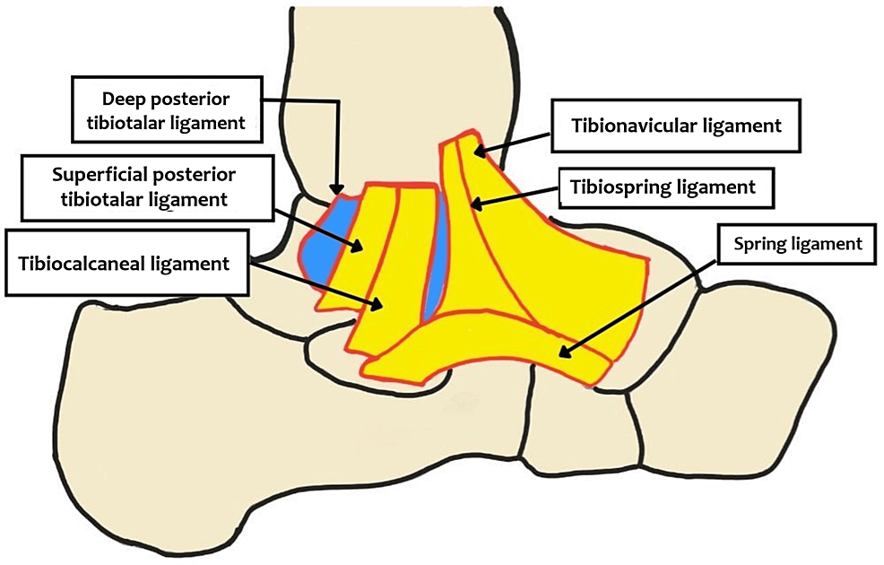

# Pied plat valgus

Propriétaire: quentin campeol

# Anatomie des stabilisateurs internes de cheville

4 stabilisateurs : 

- LCM
- Spring ligament
- Tibio-spring ligament
- Tendon tibial postérieur
     
    

# Pieds plats valgus acquis

### Causes

- **A la suite d’une entorse interne mal cicatrisée**
- **Chez les golfeurs**

### Atteintes en IRM

Spring ligament et/ou tibio-spring 

+/- tibial postérieur 

# Pieds plats valgus congénitaux