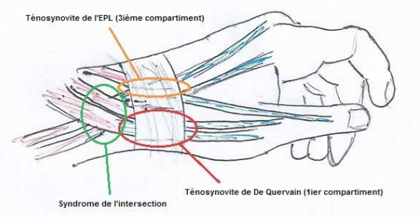

# Tendinopathies / conflits

### Tendinopathies - ténosynovites

**Extenseurs** 

Ee Quervaain = 1ère loge 

Etenseur ulnaire du carpe : 

- Tenosynovite :
    - Primaire = idiopathique ou liée à une surcharge chez un patient non sportif
    - Secondaire :
        - à une instabilité du tendon (subluxation) suite à un traumatisme ancien nottament sports de raquette
        - à une PR
- Enthésite distale (base de M5)

Long extenseur du pouce (rare, chez les batteurs, PR, suite à fracture peu déplacée radius distal) 

Extenseurs des doigts (rare, PR, fracture radius distal) 

5ème compartiment (rare) 

**Fléchisseurs** 

Fléchisseur ulnaire du carpe 

### Syndrome du croisement ou de l’intersection

Egalement appelé, de manière plus imagée, **« aïe crépitant de Tillaux ».**

⇒ Irritation par friction (péritendinite) des **tendons du 1er et 2ème compartiment des extenseurs (croisement proximal)** 
⇒ La douleur se situe donc un peu en amont de la loge de De Quervain et est majorée par les mouvements de flexion-extension du poignet, en particulier en extension contre résistance. Un crepitus (ressemblant au bruit des pas dans la neige) audible ou palpable peut également survenir lors de ces mouvements.
⇒ Cette pathologie relativement rare est typiquement associée à la répétition de
mouvements du poignet. Elle est ainsi typique des rameurs.
⇒ Le traitement de base comporte AINS, repos relatif et attelle de repos. Les infiltrations de corticoïdes peuvent être utiles en seconde ligne. Enfin, la chirurgie
est indiquée en cas d’échec (rare) des traitements médicaux et consiste en une
libération de la 2e coulisse avec ténolyse jusqu’au croisement.