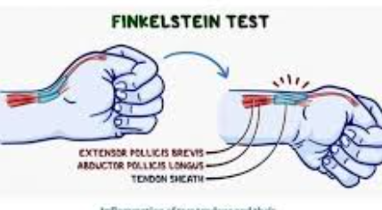

# Tendinopathies / conflits

## Tendinopathies - ténosynovites

### Extenseurs 

**De Quervain = 1ère loge**
-   **Définition :** Inflammation des tendons du court extenseur et du long abducteur du pouce au niveau du poignet.
-   **Cause :** Microtraumatismes répétés ou mouvements inhabituels du poignet et du pouce (ex: bricolage, souris, port d'un nourrisson).
-   **Symptôme clé :** Douleur vive sur le bord externe du poignet, augmentée par la saisie d'objets ou l'inclinaison du poignet.
-   **Diagnostic :** Essentiellement clinique via le **test de Finkelstein** (douleur lors de l'inclinaison cubitale avec le pouce replié dans la paume).  
-   **Traitement médical :** Repos, port d'une attelle nocturne, anti-inflammatoires (AINS) et infiltrations de corticoïdes.
-   **Traitement chirurgical :** En cas d'échec du traitement médical, pour libérer les tendons dans leur coulisse fibreuse.
-   **Prévention :** Ergonomie du poste de travail et étirements réguliers des extenseurs du pouce.

**Extenseur ulnaire du carpe :** 

- Tenosynovite :
    - Primaire = idiopathique ou liée à une surcharge chez un patient non sportif
    - Secondaire :
        - à une instabilité du tendon (subluxation) suite à un traumatisme ancien notamment sports de raquette
        - à une PR
- Enthésite distale (base de M5)

Long extenseur du pouce (rare, chez les batteurs, PR, suite à fracture peu déplacée radius distal) 

**Extenseurs des doigts** (rare, PR, fracture radius distal) 

**5ème compartiment** (rare) 

### Fléchisseurs

**Fléchisseur ulnaire du carpe**

### Syndrome du croisement ou de l’intersection

Egalement appelé, de manière plus imagée, **« aïe crépitant de Tillaux ».**

⇒ Irritation par friction (péritendinite) des **tendons du 1er et 2ème compartiment des extenseurs (croisement proximal)** 
⇒ douleur un peu en amont de la loge de De Quervain => majorée par les mouvements de flexion-extension du poignet, en particulier en extension contre résistance. Un crepitus (ressemblant au bruit des pas dans la neige) audible ou palpable peut également survenir lors de ces mouvements.
⇒ Pathologie rare typiquement associée à la répétition de mouvements du poignet (rameurs).
⇒ **Traitement**: AINS, repos relatif et attelle de repos. Les infiltrations de corticoïdes peuvent être utiles en seconde ligne. Enfin, la chirurgie est indiquée en cas d’échec (rare) des traitements médicaux et consiste en une
libération de la 2e coulisse avec ténolyse jusqu’au croisement.