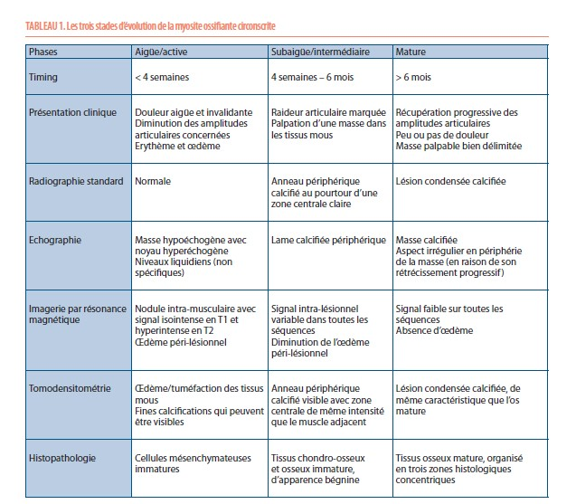

# Pseudo tumeurs et tumeurs musculaires

Propriétaire: quentin campeol

# Pseudo-tumeurs

**Myosite ossifiante  hypertrophique :**

Polifération osseuse hétérotopique non tumorale à l’intérieur du tissu mou, et plus particulièrement au sein du muscle strié squelettique.
La forme la plus fréquemment rencontrée est la forme acquise qui est bénigne. Souvent, elle est liée à un traumatisme (60%) mais peut aussi apparaitre sans aucun élément déclencheur. Elle évolue en trois stades (aigu, subaigu et mature)

Diagnostics différentiels :

- sarcome
- abcès musculaire
 

Comment faire le diagnostic ? 

- Écho a la phase aiguë et radios
- Répéter les radios pour voir l’évolution des calcifications : “toute lésion musculaire qui n'évolue pas entre 2 contrôles devrait faire évoquer une tumeur”
- IRM
- Toute biopsie doit se discuter en RCP car a la phase initiale une biopsie d’une zone centrale de myosite ossifiante peut ramener des cellules qui font penser a un sarcome

**Abcès musculaire :** 

# Tumeurs