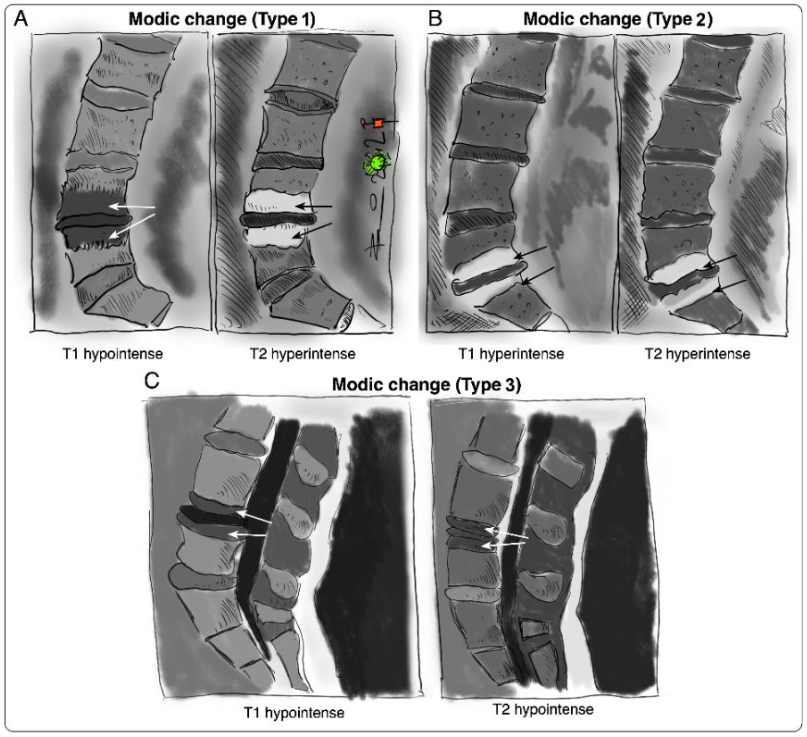
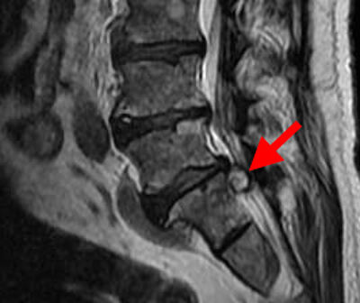
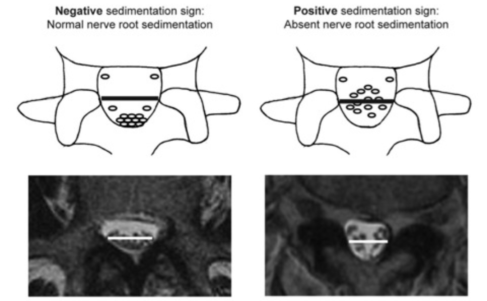
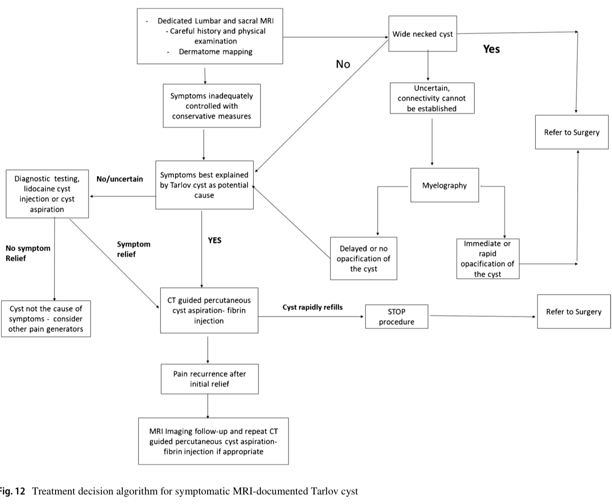

# Rachis

Propriétaire: quentin campeol

# Anatomie

### Rachis lombaire :

**2 étages a regarder principalement sur les coupes :** 

1. Étage mobile = Coupe des disques + articulaires postérieures
2. Étage du canal lombaire 

Disque normal = concave 

**Hauteur des disques augmente de haut en bas :** 

- Les disques thoraciques sont fins
- Le disque L4-L5 est le plus haut
- Le disque L5-S1 est moins haut que le L4-L5

**Moelle osseuse normale en fonction de l'âge**
- 50 ans = 50% de graisse
- 80 ans = 80% de graisse 
=> Une moelle avec moins de graisse que prévu de manière diffuse (moins hyper T1 que les disques) = remplacement médullaire

# Pathologies mécaniques

[Fractures vertébrales](Rachis/Fractures-vertébrales.md)

[Anomalies de forme des vertèbres](Rachis/Anomalies-formes-vertèbres.md)

### MODIC

MODIC 1 = inflammatoire et hypervascularisation 

MODIC 2 = involution graisseuse

MODIC 3 = fibrose et hyperostose 

### Hernies discales :

Localisation : 

- Médiane, latérale, foraminale
- Migrée vers le haut ou vers le bas

Sous ligamentaire ou exclue si rupture du ligament jaune

### **Kyste arthro-synovial des articulaires postérieures au niveau du rachis :**

Sémiologie radio :

- Raccordement a l’articulairee postérieure avec un angle obtu
- Touche le corps vertébral avec un angle aigu
    - C’est l’inverse d’une hernie discale
- Il y a un contenu liquidien a l’intérieur
    
    
    

Peut aussi contraindre une racine en foraminal 

### **Canal lombaire  :**

**A mesurer sur une coupe pédiculoarticulaire ou pédiculolamaire.**

**Il faut aussi prendre en compte les structures capsulo-ligamentaires :** 

- Articulations articulaires postérieures
- Ligaments interlamaires = ligaments jaunes
- Disques intervertébraux

**Valeurs statistiques moyennes normales pour les
dimensions du canal :**

- la valeur moyenne du diamètre antéropostérieur est de 15 à
17 mm ;
- le diamètre interpédiculaire augmente de L1 (20 mm) à L5
(25 mm) ;
- la longueur du pédicule diminue de L1 (16 mm) à L5 (8 mm) ;
- le diamètre antéropostérieur du récessus latéral est supérieur ou égal à 5 mm. Il augmente de L1 à L5.

**Sténoses canalaires :** 

- Sténose absolue si diabètre antéro-postérieur **≤** 10mm
- Sténose relative entre 10 et 12mm

**Etroitesse du récessus latéral si diamètre < 3 mm**

**Il faut aussi mesurer la surface du fourreau dural :**

- Mesure ROI de surface du fourreau dural- Faire la différence entre étage mobile et fixe
- Significatif a partir de 70%

**Nerve root sédimentation sign :** 

- Positif (normal si les racines son regroupées en bas)
- Négatif en cas de CLE

**Causes de CLE :**

- Articulaires post
- Ligaments jaunes
- Disques
- Lipomatose épidurale :
    - Graisse derrière les corps vertébraux et les disques, de manière continue d’un étage à l'autre.
    - Généralement secondaire a corticothérapie.

### Lyse isthmique

Se voit sur la coupe pédiculo-lamaire dans laquelle normalement on voit l’intégralité du cadre osseux entourant le canal. A ne pas confondre avec l’articulation zygapophysaire.

### Kystes de Tarlov

Kystes entre la pie mère et l’arachnoïde au niveau des racines nerveuses surtout sacrées 

Prévalence 4%

11mm en moyenne

La plupart du temps asymptomatiques mais peuvent entrainer des douleurs lombaires, sacrées, radiculalgies, problèmes urinaires, gyneco et sexuels,…

Signe important = douleur sacrée à la station assise 

# Pathologies infectieuses

**Spondylodiscite infectieuse :**

- Meilleure séquence IRM pour l’étudier = T1 simple ⇒ pour voir les érosions des plateaux vertébraux