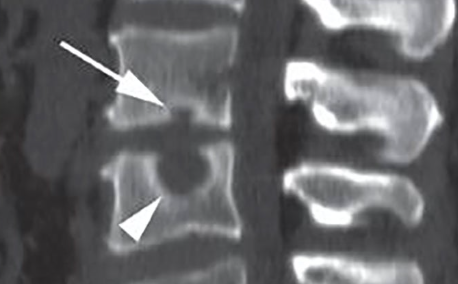
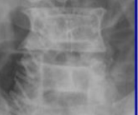

# Anomalies de forme des vertèbres

Propriétaire: quentin campeol

### Noeuds de schmorl = Hernies intradiscales

**Peuvent se retrouver :** 

- De façon idiopathique
- Dans la maladie de Scheuerman

### Vertèbres en H

 

Dépression de la plaque terminale centrale nettement délimitée

**Physiopathologie :** infarctus microvasculaire de la plaque terminale

**Etiologies :** 

- Environ 10 % des patients atteints de drépanocytose
- Maladie de Gaucher