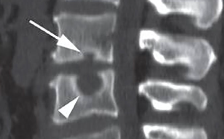
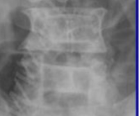

# Anomalies de forme des vertèbres

### Noeuds de schmorl = Hernies intradiscales

**Peuvent se retrouver :** 
- De façon idiopathique => Très fréquentes (75% des études cadavériques)
- Dans la maladie de Scheuerman

  
**Caractéristiques**
- Protrusions du cartilage du disque intervertébral à travers le plateau vertébral et dans la vertèbre adjacente. Ces protrusions peuvent entrer en contact avec la moelle osseuse de la vertèbre, provoquant une inflammation.
- Petites lésions touchant le plateau inférieur des corps vertébraux thoraciques inférieurs et lombaires plus que les plateaux supérieurs. Un bord sclérotique peut être présent (mais absent à la phase aigue inflammatoire)

### Vertèbres en H

 

Dépression de la plaque terminale centrale nettement délimitée

**Physiopathologie :** infarctus microvasculaire de la plaque terminale

**Etiologies :** 

- Environ 10 % des patients atteints de drépanocytose
- Maladie de Gaucher