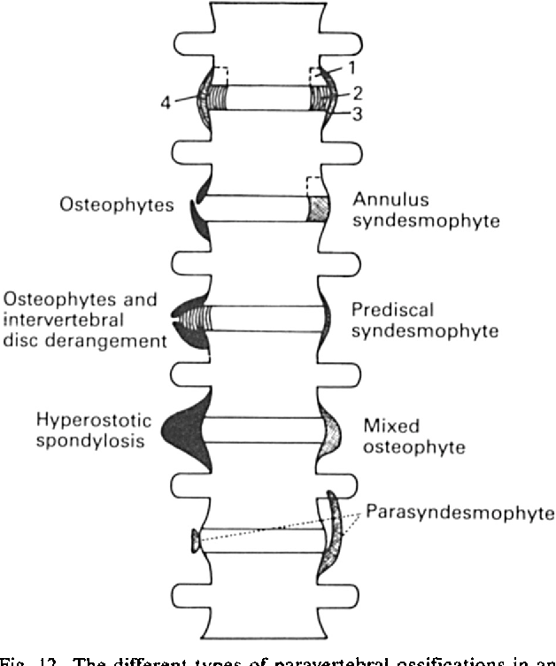

# Echographie du pré-rhumatisme psoriasique

# Echographie du rhumatisme psoriasique
Moyen mnémotechnique : 007 
Oedème sous cutané
Ongle
Synovite
Enthésite
Paraténonite 
Ténosynovite 

# Radiographie

## Atteinte périphérique

### Association caractéristique : érosion + reconstruction osseuse

Le rhumatisme psoriasique associe typiquement :

**→ des lésions destructrices**

-   Érosions **centro-marginales** articulaires.
    
-   **Ostéolyse**, notamment dans les formes sévères.
    
-   **Acro-ostéolyse** des houppes phalangiennes.
    

**→ et des lésions prolifératives**

-   **Néoformation osseuse péri-articulaire**.
    
-   Aspect **irrégulier, flou (« fuzzy »)** des berges articulaires et des houppes phalangiennes.
    
-   **Périostite** des métacarpiens et des phalanges :
    
    -   apposition osseuse périostée ;
        
    -   ou épaississement cortical irrégulier.
        

➡️ **L'association érosions + prolifération osseuse est très évocatrice du rhumatisme psoriasique.**

***

## Déformations caractéristiques

### « Pencil-in-cup »

-   Une extrémité osseuse devient effilée en **« pointe de crayon »**.
-   L’os adjacent présente une érosion concave en **« cupule »**.
-   Signe évocateur d’une maladie évoluée, mais **non pathognomonique**.

### Arthrite mutilante

Forme destructrice sévère : 
-   ostéolyse importante 
-   destruction et collapsus articulaires ;
-   raccourcissement des doigts.

→ Peut entraîner des **« doigts télescopiques »**.

### Autres anomalies

-   **Subluxations articulaires**.
-   **Ankylose** articulaire possible.
-   **Ostéopénie juxta-articulaire ou diffuse**, mais généralement **moins marquée que dans la polyarthrite rhumatoïde**.
-   Rare : **« ivory phalanx »**, correspondant à une condensation diffuse d’une phalange, classiquement la phalange distale du gros orteil.

## Atteinte axiale

### Sacro-iliite

-   Peut être **unilatérale**.
    
-   Si bilatérale, elle est volontiers **asymétrique**.
    
➡️ À la différence de la spondyloarthrite ankylosante classique, où la sacro-iliite est typiquement bilatérale et symétrique.

### Atteinte rachidienne

#### Parasyndesmophytes

-   Ossifications **paravertébrales épaisses et irrégulières**.
-   Distribution souvent **asymétrique**
-   Peuvent être volumineuses et ne pas suivre parfaitement le bord externe de l’annulus.
    
