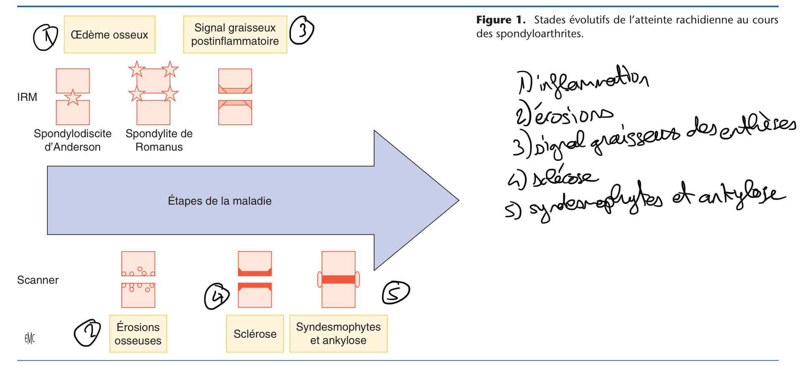
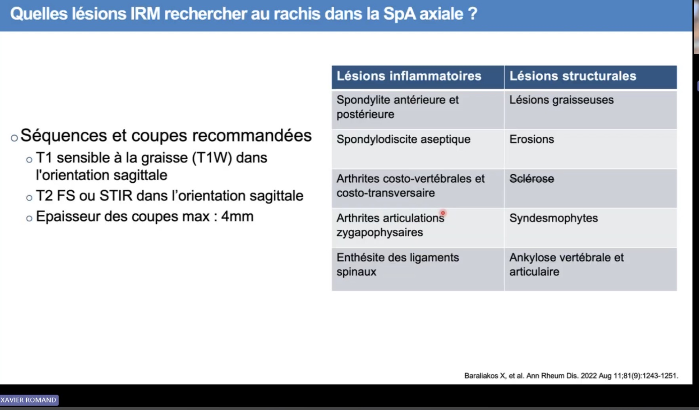
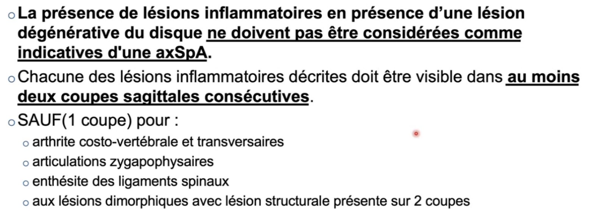
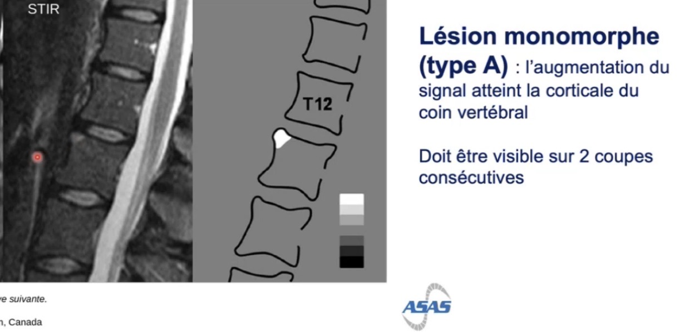
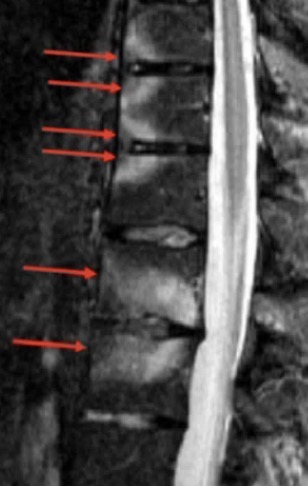
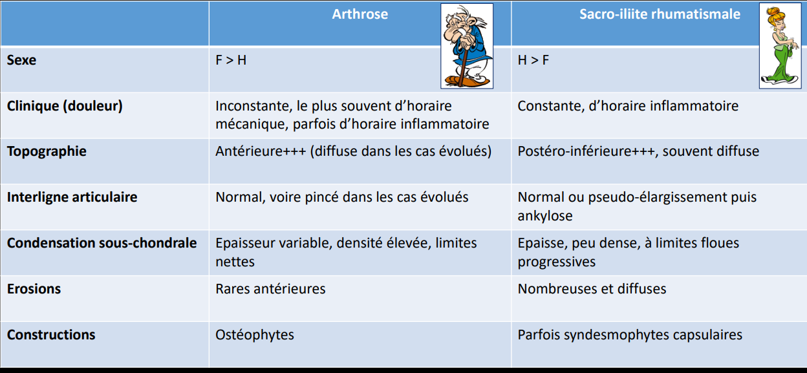
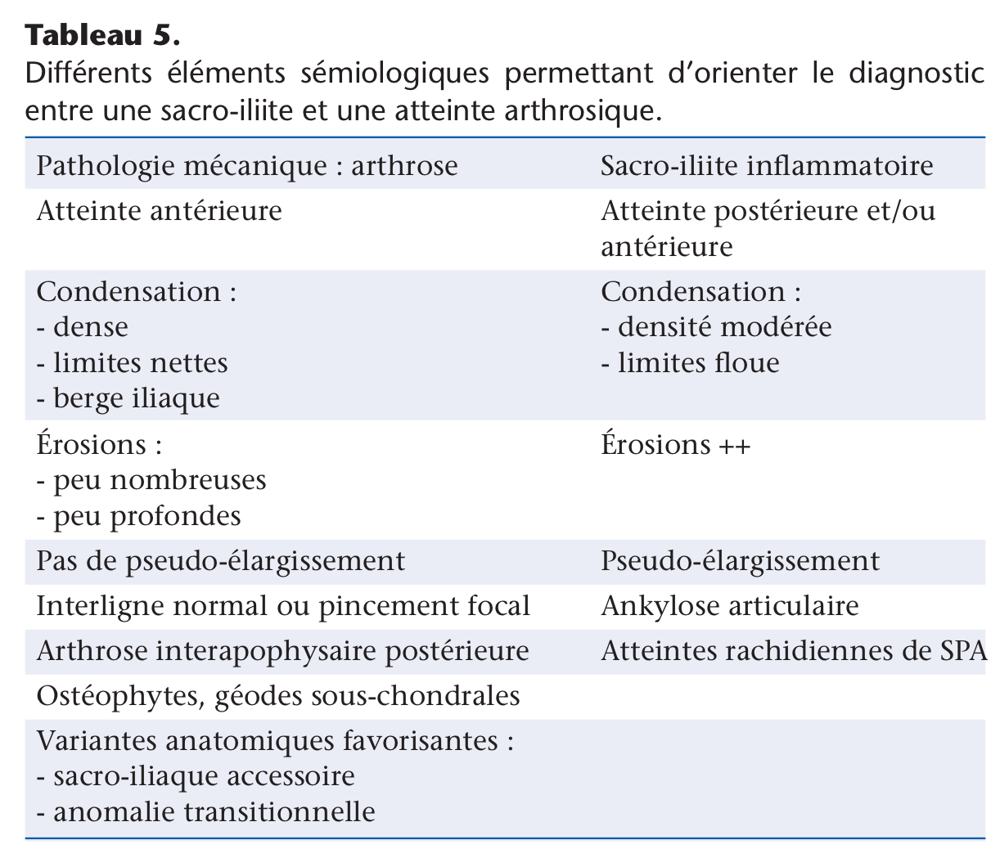

# Spondyloarthrites

## Atteinte rachidienne des SPA

Séquences IRM : 

- T1 fat pour les lésions structurales
- T2 fat saut pour les lésions inflammatoires

Attention il faut au moins 4-5 lésions inflammatoires et 3 lésions graisseuses du rachis pour augmenter la spécificité du diagnostic 

Attention on ne peut pas considérer des lésions si étage discal dégénératif 

Lésion dimorphique = à la fois inflammatoire et scléreuse ou graisse 

**Élément indispensable au diagnostic = œdème osseux sous chondral (enthésite seule insuffisante)**

**Atteinte vertébrale antérieure :**

Phase inflammatoire : 

- Premier signe d’atteinte du rachis dans les SPA = spondylite de romanus = œdème osseux des coins vertébraux qui commence en antérieur (correspond à l’inflammation des fibres de sharpey qui sont les fibres les plus+ périphériques de l’annulus fibrosus)
- Il y a aussi la spondylite ou spondylodiscite d’Anderson
    - Les plateaux vertébraux présentent initialement un hypersignal inflammatoire, puis un remaniement graisseux, enfin
    un hyposignal témoignant de l’ostéosclérose
    - Le disque peut être inflammatoire
    - Au stade ultime les plateaux vertébraux fusionnent
- Puis apparition d’érosions osseuses mieux visibles en scanner qui entraînent une mise au carré de la vertèbre.

Stades post inflammatoires = cicatriciels  : 

- Signal graisseux
- Sclérose (mais pas spécifique)
- Syndesmophytes et parasyndesmophytes = stade ultime de la spondylite de romanus

Syndesmophytes = ossification fines et symétriques

Parasyndesmophytes = ossifications epaisses, asymétriques et plus à distance du corps vertébral, s’observent dans : 

- le rhumatisme psoriasique
- les arthrites réactionnelles
- Le sapho
- Mais aussi le rachitisme vitaminoresistant hypophosphatasemique familial

**Autres atteintes vertébrales :**

- ligaments postérieurs :
    - Interlamaires
    - Interepineux + épineuses et parties molles autour
    - Supraspinaux
- articulaires postérieures
- Costovertebrales et Costotransversaires

## Imagerie des sacro-iliaques dans les SPA

Atteinte sous chondrale fondamentale = œdème osseux à bords flous 

Atteinte articulaire qui prédomine sur le versant iliaque  :

1. Pseudo élargissement de l’articulation qui commence en inférieur 
2. Érosions 
3. Pincement 
4. Condensation des berges et formation de ponts osseux 
5. Ankylose

Diagnostics différentiels : 

- Arthrose
- Ostéose iliaque condensante :
    - Ostéocondensation iliaque triangulaire uni ou bilatérale avec atteinte modérée du versant sacré, survenant surtout les femmes après une grossesse. Souvent asymptomatique. Possible douleurs sacro-iliaques mécaniques. Intégrité de l'interligne articulaire.
    - TDM : ostéocondensation triangulaire à limites nettes, intégrité de l'interligne articulaire
    - IRM : Aspect en hyposignal T1 et T2 des berges iliaques et parfois sacrées
- Hyperparathyroïdie
- Sacroilite infectieuse ⇒ une atteinte unilatérale doit y faire penser même si possible aussi sans la spa

## Atteinte articulaire périphérique dans les SPA

## Échographie des enthèses dans les SPA

Faire une échographie 15 jours à distance d’une activité physique intense et de l’utilisation d’AINS.

L’atteinte inflammatoire part de l’os et va vers le tendon alors que c’est l’inverse pour l’atteinte mécanique.

Ce qui en découle ⇒ les deux lésions les plus discriminantes pour le diagnostic d’une enthesopathie inflammatoire sont :

- un signal Doppler puissance ≥ 1 dans les 2mm contre l’os qui correspondent à l’enthèse à proprement parler
- Les érosions osseuses

Autres atteintes non spécifiques = calcifications et enthesophytes.

Définition OMERACT de l’enthesite active = Doppler puissance ≥ 1 avec épaississement ou zones hypoechogènes, ou un signal Doppler puissance > 1 isolé.

Parmis les enthèse l’atteinte du tendon d’Achille est la plus discriminante.

## IRM des entheses dans les SPA

Utile lorsque on a un doute en échographie 

Le signe le plus discriminant de SPA est un œdème intra-osseux au contact de l’enthèse.

Interprétation d’une IRM rachidienne de suspicion de SPA :

- Coins vertébraux
- Discite d’Andersen
- Costo transversaire
- Articulaires postérieures
- Inter épineux (bursites)