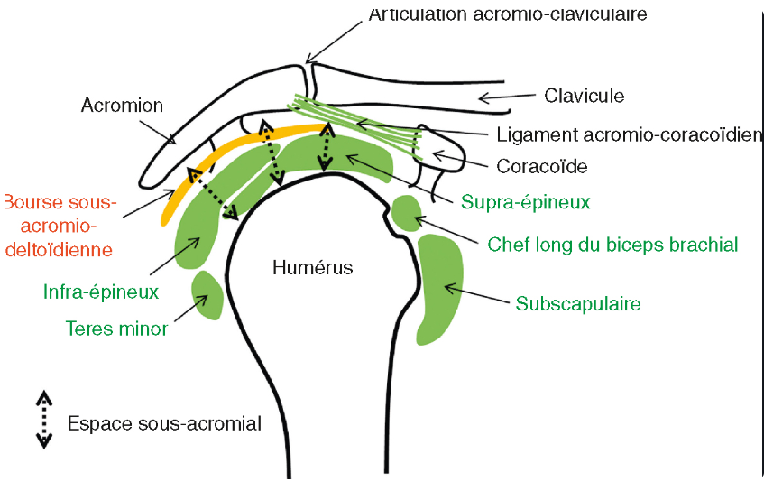
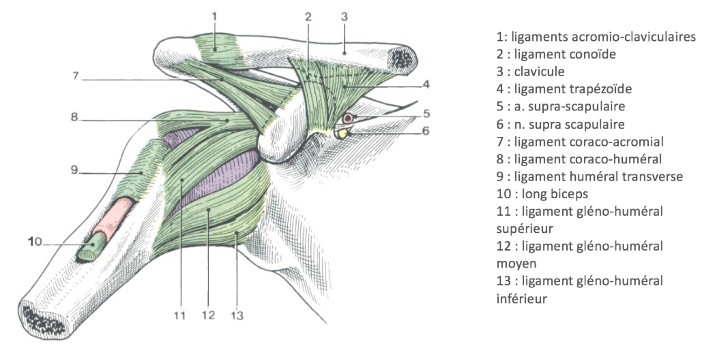
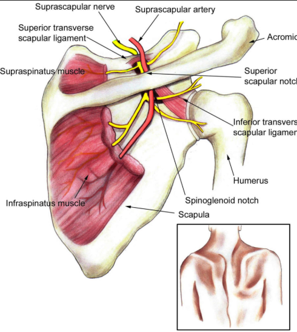
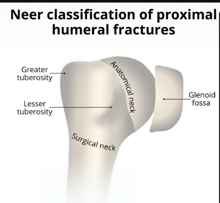

# Épaule

## Anatomie
 
 
 

## Clichés radiographiques

**Critères qualité des clichés d’épaule :** 

**FACE**
1. Interligne gléno-huméral dégagé avec superposition des deux rebords glénoidiens
2. Bien dégager l’espace sous acromio-deltoidien
3. Cintre gléno-huméral
4. Superposition clavicule et acromion
5. Rotations : 
    1. Rotation Neutre : Sillon intertuberculaire au centre 
    2. RI ⇒  Tubercule mineur au centre, aspect en “marteau” 
    3. RE ⇒ dédoublement des tubercules 

**PROFIL**
1. Tête au centre du Y de la clavicule 
2. Superposition clavicule et diaphyse humérale 

## Tendinopathie de la coiffe

**Conflits :** 

Conflit sous acromial = antéro-supérieur : 

- Entre le supra-épineux et l’acromion, ainsi que le ligament acromio-coracoïdien :
    - Possiblement lié à un enthésophyte de l’acromion visible sur le profil de LAMY
        
        
        
- Réduction de l’espace sous acromial en radio = inférieur à 9 mm sur :
    - Radio de face en rotation externe ⇒  + sensible pour montrer la réduction de cet espace
    - Profil de LAMY

Conflit antéro-interne : 

- Entre la coracoïde et supra-épineux ou long biceps ou subscapulaire

Conflit postéro-supérieur : 

- Contact itératif entre la face inférieure du supraépineux à son insertion trochitérienne et le bord postérosupérieur de la glène, se produisant lors de l’armé, au cours de la pratique de certains sports de lancer
\
**Classification des ruptures tendineuses :** 
- Partielles :
    - Profondes
    - Superficielles
    - Intratendineuses = clivages interstitiels
- Transfixiantes

**Il existe des associations à rechercher entre :** 
- géode d’inclusion synoviale doit faire rechercher une rupture de coiffe
- un clivage intra-tendineux doit faire rechercher une rupture profonde à l’enthèse

## Calcifications de la coiffe des rotateurs

**Classification des calcifications apatitiques**

|  | **Molé** | **Société française d’arthrographie**  | **Echographie**  |
| --- | --- | --- | --- |
| **Type A** | Calcification dense, homogène, à contours nets (20 % des cas) | Homogène à bords nets  | Dense, atténuation forte  |
| **Type B** | Calcification dense, cloisonnée, polylobée, à contours nets (44 % des cas) | Inhomogènes à bords nets ou homogène à bords flous  | Atténuation moyenne  |
| **Type C** | Calcification hétérogène, à contours festonnés (32 % des cas) | Nuageuse, peu dense  | Molle, non atténuante  |
| **Type D** | Calcification dystrophique d’insertion, dense, de petite taille, en continuité avec le trochiter (4 % des cas), correspondant plutôt à une enthésopathie d’insertion |  |  |

Seules les calcifications de type A ou B sont accessibles à une ponction aspiration lavage, et que en deuxième intention si le traitement médical est inefficace

Bursite calcique sub-acromiodeltoïdienne traduisant la résorption de la calcification. 

## Compressions nerveuses à l'épaule
  [Compression du nerf supra-scapulaire ](Echographie/Nerf-suprascapulaire.md)
  [Syndrome canalaire de l’espace quadrilatère de Velpeau ](Echographie/Velpeau.md)

## Fractures de l'extrémité supérieure de l'humérus (FESH)
### Classification de Neer 
 

### Complications des FESH
* Paralysie des nerfs radial / axillaire
* Ostéonécrose :
  * Lésion artère
  * Plus à risque si : 3/4 fragments, atteinte col anatomique, fracture + luxation
* Raideur
* Cal vicieux
### Traitement 
Si un fragment => immobilisation 
Si au moins 2 fragments => PEC chir 