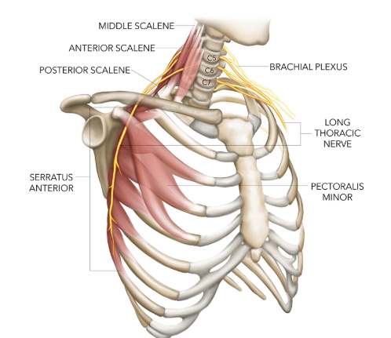
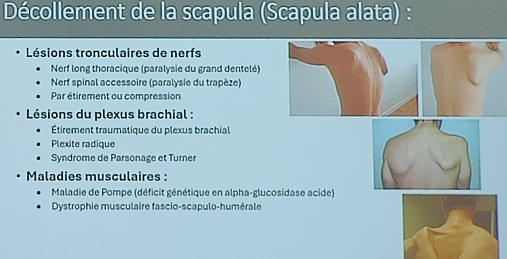

# Scapula alata & dyskinésies scapulaires 

## 1) Scapula alata
-   Décollement du bord médial de la scapula → aspect « aile d’ange ».
-   Cause principale : atteinte du **nerf thoracique long** → paralysie du dentelé antérieur, causes :
    * Traumatique : choc direct, traction brutale du bras, chute. Microtraumatismes répétés : sports au-dessus de la tête, musculation.
    * Chirurgical : curage axillaire, chirurgie mammaire ou thoracique.
    * Compression prolongée : sac à dos lourd, béquilles mal réglées.
    * Plexopathie brachiale.
    * Syndrome de Parsonage-Turner (cause fréquente non traumatique).
    * Radiculopathie C5–C7 (plus rare, rarement isolée).
    * Neuropathies inflammatoires ou post-infectieuses.
    * Causes compressives locales (tumeur, adénopathie axillaire).
* Autres causes : lésion du **nerf spinal accessoire** (trapèze).
* Clinique : aspect « aile d’ange » majorée lors de la poussée contre un mur.

 
## 2) Dyskinésies scapulaires

-   Trouble **fonctionnel** du mouvement ou du positionnement scapulaire.
    
-   Pas toujours neurologique ; souvent lié à déséquilibre musculaire (trapèze inf., dentelé ant.).
    
-   Fréquent chez sportifs du membre supérieur (lancers, natation).
    
-   Signes : asymétrie, bascule antérieure, rotation insuffisante, douleur d’épaule.
    
-   Prise en charge : rééducation ciblée (contrôle moteur, renforcement, étirements).
    
