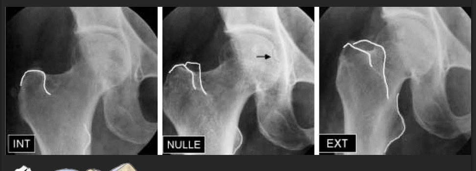
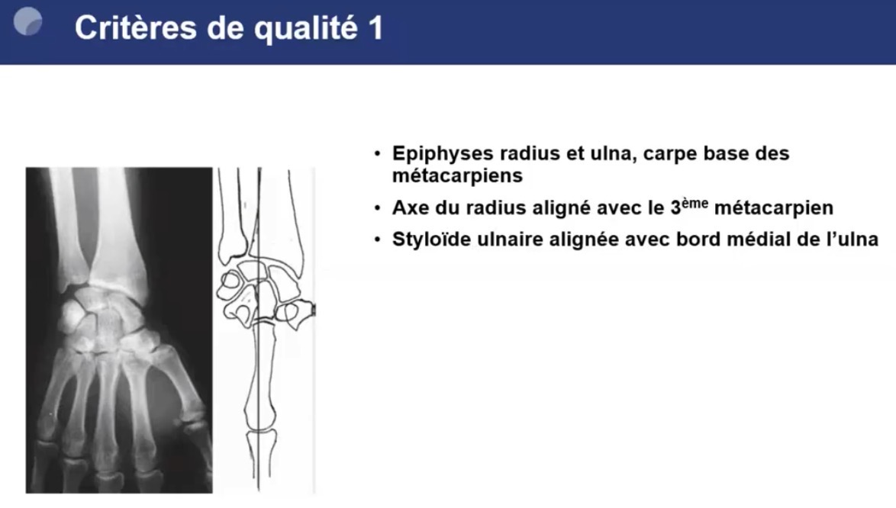
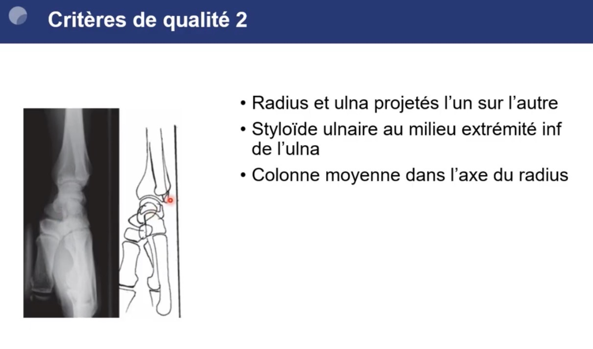
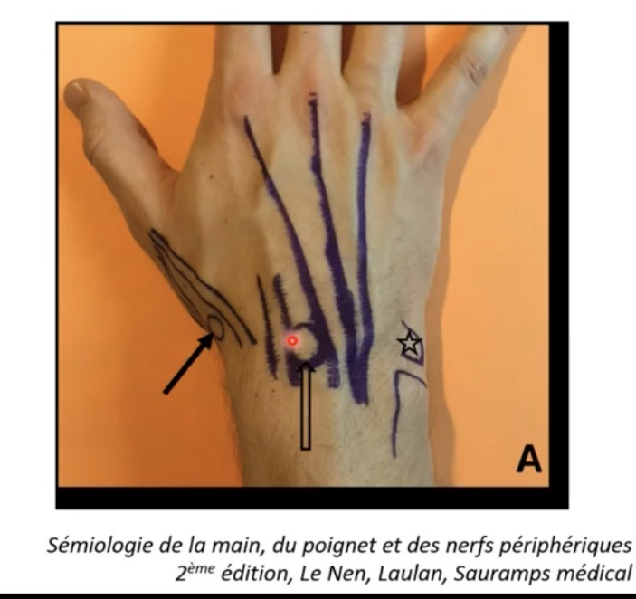
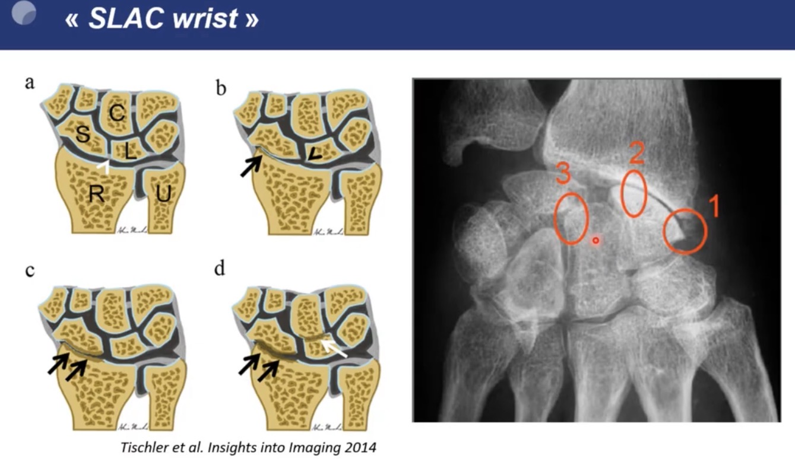

# Arthrose

Propriétaire: quentin campeol

# Hanche

### Clichés à faire :

- Bassin de face (15° de rotation externe)
- Hanches bilatérales de face (15° de rotation externe) + faux profil de Lequesne

### Cliché de hanche de Face

**Utilité :** Permet de voir le versant antérieur de l’interligne, ainsi que le toit du cotyle 

**Critères de qualité :** 

1. Bassin visible en totalité (L4 et crêtes iliaques en haut,
massifs trochantériens en bas)
2. Bassin symétrique : 
    1. superposition de l'axe des épineuses et du sacrum
    avec la symphyse pubienne
    2. trous obturateurs
    symétriques
3. Antéversion bien corrigée (15°) 
    1. Cols fémoraux bien "déroulés"
    2. Grands trochanters bien dégagés en position externe
    3. Petits trochanters barrés par les corticales internes des
    diaphyses fémorales

**Aspect normal :** 

- L’interligne normal est plus large à l’extérieur qu’à l’intérieur

**Coxométrie :** 

- Angle cervico-diaphysaire - normale < 135 à 140° sinon coxa valga :
    
    C= centre de la tête fémorale
    D= centre de la diaphyse
    C’= intersection des lignes passant par C (axe du col) et D ( axe de la diaphyse
    
- Couverture externe de la tête fémorale (**N > 25°**) :
    - Angle VCE
    - Verticale/Centre tête fémorale/point Externe du toit du cotyle
- Obliquité du toit du cotyle (**N < 10°**)
    - Angle HTE
    - Horizontale/point interne du Toit du cotyle/point Externe du toit du cotyle

**Signe de subluxation dans le cadre d’une dysplasie de hanche = rupture du cintre cervico-obturateur :** 

### Faux profil de Lequesne

**Utilité :** Etude du versant supéro-externe de l’interligne

**Critères de qualité :** 

1. Le col se superpose au grand trochanter
2. Petit trochanter légèrement saillant 
3. On pourrait faire passer la taille d’une petite tête fémorale entre les 2 
    
    
    

**Aspect normal :** 

Le pincement est souvent plus précoce sur cette incidence : 

- souvent antéro-supérieur.
- parfois postérieur

Le gradient de l’interligne articulaire est mieux visible sur cette incidence pour dépister un pincement antéro-supérieur débutant : 

- l’interligne s’aggrandit régulièrement de sa partie
postérieure à sa partie antérosupérieure
    
    ⇒ Un interligne sans gradient en faux profil est déjà pathologique, signifiant un
    début de pincement antérosupérieur= signe de l’égalisation des interlignes.
    
    ⇒ On peut aussi comparer le gradient du faux profil à celui du côté controlatéral
    

- Couverture antérieure de la tête (**N > 25°**)
    - Angle VCA
    - Verticale/Centre de la tête/point antérieur du toit du cotyle
    

### **Types d’ostéophytose :**

- En collerette = au pourtour de la tête fémorale avec une ostéophytose marginale céphalique
- Péri-fovéale (fovéa = dépression dans la tête qui correspond au point d'attache pour le ligament rond)
- De l’arrière fond de l’acetabulum = double fond
- Aux pourtours de l’acetabulum

### Types de coxarthrose :

### **Primitives**

**Coxarthrose débutante :** 
Le pincement est souvent : 

- soit discret (à comparer au côté sain)
- soit antérosupérieur ou postérieur et dans ces cas non visible sur le cliché de face (dans 1/3 des cas) ⇒ le faux profil est seul probant (dans 25% des cas).
- soit absent (dans 8% des cas) ⇒  il faut rechecher l’ostéophytose +/- ostéocondensation et géodes

L’ostéophytose est présente dans 90% des cas même d’arthrose débutante. 

- Péri-fovéale +++ (58%)
- Double fond +++ (52%)

**Formes engainantes :** 

Ostéophytose marquée un interligne qui peut rester indemne longtemps

**Coxarthrose destructrice rapide :** 

- Pincement progressant de 2mm par an
- Pas d’ostéophyte

**Coxarthrose postérieure** 

- Visible sur faux profil uniquement

### **Secondaires**

**Dysplasie de hanche subluxante**

Coxométrie ⇒ défaut de couverture de la hanche, voxa valga,…

**Conflits fémoroacétabulaires**

**Coxarthrose du sportif**

Postérieure +++

**Protrusion acétabulaire :** 

- distance > 3 mm chez l’homme et 6 mm chez la femme entre la ligne acétabulaire et la ligne ilio-ischiatique sur un cliché de bassin strictement de face

**Post traumatiques** 

**Chondrocalcinose** 

En IRM penser à la CCA devant une coxarthrose congestive avec un oedème diffus de l’acetabulum et de la tête fémorale qui va jusque au col fémoral ! 

**Rhumatisme inflammatoire** 

**Secondaires à des affections neurologiques** (myopathies, polyomyélite antérieure aigue) ****

# Genou

## Critères radiologiques de Kellgren et Lawrence

**0 - Radio Normale**
**1 - Très léger ostéophyte ou pincement**
**2 - Ostéophytes**, pincement de l’interligne articulaire
**3 -** Ostéophytes de moyenne importance, pincement articulaire **avec sclérose sous chondrale**
**4 - Gros ostéophytes, pincement complet de l’interligne, sclérose sévère, déformation**

Souvent l’os sous chondral médial est plus condensé que le latéral c’est normal ⇒ vérifier qu’on voit les travées osseuses : pas de condensation sous chondrale si on voit la trame 

### Dysplasie femoro patellaire :

Signe du croisement sur genou de profil (ligne du fond de la trochlée qui vient croiser la ligne du condyle fémoral) 

Défilé femoro patellaire à 30° de flexion 

# Digitale

# Epaule

## Omarthrose excentrée

**Se définit radiologiquement par :**

- Un pincement de l’ESA.
- Une arthropathie sous acromiale avec remodelage du tubercule majeur.

**Ses signes peuvent se compliquer par :**

- La constitution d’une néoarticulation acromio humérale.
- Une chondrolyse gléno-humérale

**Classification de HAMADA omarthrose centrée :** 

Stade 1 ESA normal (> 6mm)

Stade 2 ESA diminué (< 6mm)

Stade 3 = stade 2 + 
Acétabulisation de la face inférieure de l’acromion

Stade 4A = stade 2 + 
Pincement glénohuméral sans acétabulisation de la face inférieure de l’acromion

Stade 4B = stade 2 + 
Pincement gléno huméral
Acétabulisation de la face inférieure de l’acromion

Stade 5 = stade 2 + 
Nécrose massive de la tête humérale

## Omarthrose centrée

**Se définit par :**

- Une ostéophytose céphalique humérale au bord antéro-inférieur de l’articulation
- Un espace sous acromial
respecté.
- Un pincement tardif de l’interligne
gléno-huméral, qui se voit mieux sur le cliché en rotation externe

### Classification Samilson omarthrose centrée

# Poignet

### Critères de qualité des radios du poignet

## Arthrose radio-scaphoïdienne

Principalement causes secondaires par ordre de fréquence : 

1. Traumatiques : 
    1. Instabilité scapho-lunaire = **SLAC wrist** secondaire à la rupture du ligament scapho-lunaire
    2. Pseudarthrose ou ostéonécrose scaphoïdienne post traumatique = **SNAC wrist** 
2. Microcristalline = **SCAC wrist** pour scaphoïd chondrocalcinosis advanced collapse
3. Microtraumatique

### SLAC Wrist

Clinique : 

- rechercher un atcd de traumatisme
- Au stade precoce il peut avoir
    - une synovite
    - la palpation du lunatum est douloureuse entre l’extenseur radial du carpe et commun des doigts.
- Testing de l’instabilité scaphoïde lunaire :
    - Ballotement scapholunaire
    - Manœuvre de Watson

**Aspect radiographique = Diastasis scapholunaire supérieur à 3 mm**, associé à une altération dégénérative qui varie selon le stade évolutif :

- Stade I : bec de la styloïde radiale, sclérose et rétrécissement de l'espace articulaire entre le scaphoïde et la styloïde radiale
- Stade II : pincement radio scaphoïdien
- **Stade III :** ostéosclérose et pincement de l'espace articulaire **entre le lunatum et le capitatum**, **avec possible migration proximale du capitatum dans l'espace créé par la dislocation scapholunaire.**

**Clichés à demander pour rechercher diastasis scapholunaire  :** 

- Cliché en inclinaison ulnaire
- Cliché avec poing fermé
- Diastasis > 4mm en radio ou écho

→ Mêmes manœuvres en écho 

### SCAC wrist

**L'aspect est distinct dans l'arthrose secondaire à la chondrocalcinose =** absence de diastasis scapholunaire et « incrustation » du scaphoïde dans le radius + Ostéocondensation sous-chondrale intense, à limite nette

### SNAC wrist

Plus rare en rhumato

Plutôt ortho mauvaise consolidation ou osteonecrose du scaphoïde post traumatique

Aspect comme SNAC mais pas de pincement avec le pôle proximal du scaphoïde