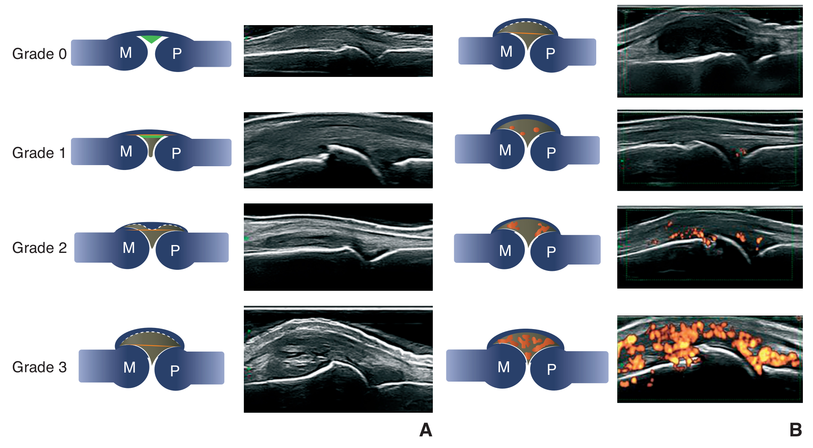
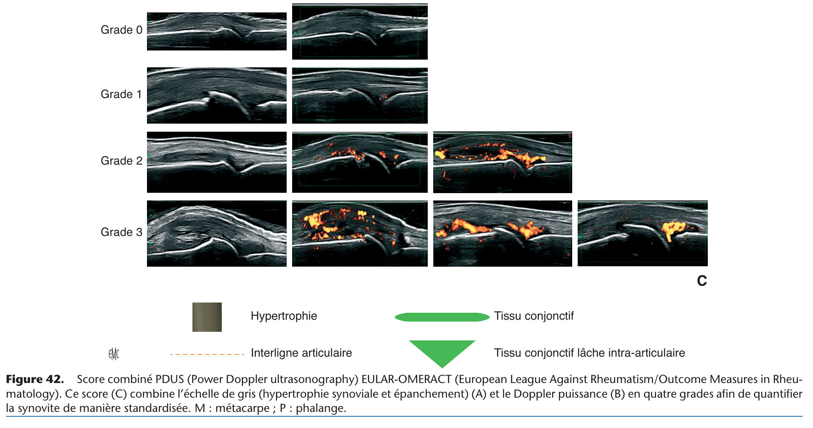

# Echographie

Propriétaire: quentin campeol

### Protocoles de réalisation échographie

[Protocole échographie pour recherche de rhumatisme psoriasique infra-clinique](Echographie/Protocole%20%C3%A9chographie%20pour%20recherche%20de%20rhumatisme%202bd45f5988be8073a14cff5b49fe45ba.md)

[Protocole échographie épaule](Echographie/Protocole%20%C3%A9chographie%20%C3%A9paule%202bd45f5988be80779ec4c95fa806935c.md)

[Protocole tendinopathie d’achille](Echographie/Protocole%20tendinopathie%20d%E2%80%99achille%202c445f5988be80498d6de1339c6aa3a1.md)

[Protocole radio + échographie devant des talalgies ](Echographie/Protocole%20radio%20+%20%C3%A9chographie%20devant%20des%20talalgies%202c945f5988be80a4958cd70ce9fee9d7.md)

### Autres

[Indications de l’échographie en rhumatologie ](Echographie/Indications%20de%20l%E2%80%99%C3%A9chographie%20en%20rhumatologie%2018345f5988be80bc83f1c4c298821ab8.md)

[Mesures en écho ](Echographie/Mesures%20en%20%C3%A9cho%2015545f5988be80448d38e3dc3032655a.md)

[Gestes sous écho en pratique](Echographie/Gestes%20sous%20%C3%A9cho%20en%20pratique%2014545f5988be80e8be9aefd499ae04af.md)

Pour confirmer le double contour : il faut bouger l’articulation du patient afin de confirmer que ce n’est pas un artefact 

